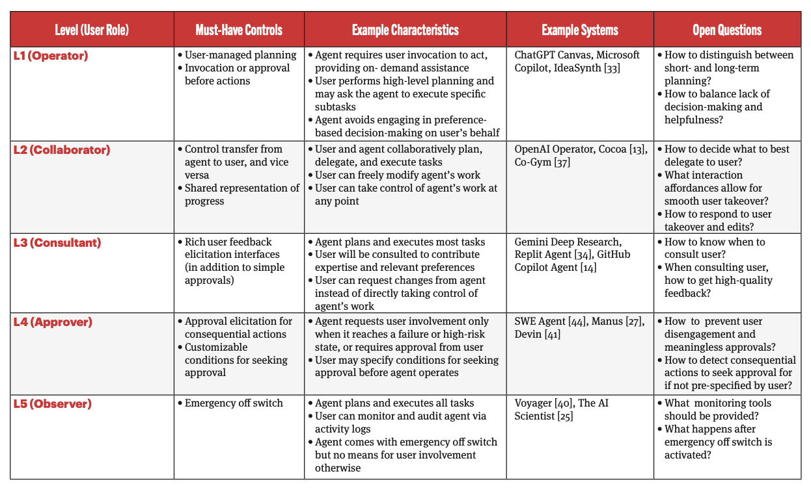
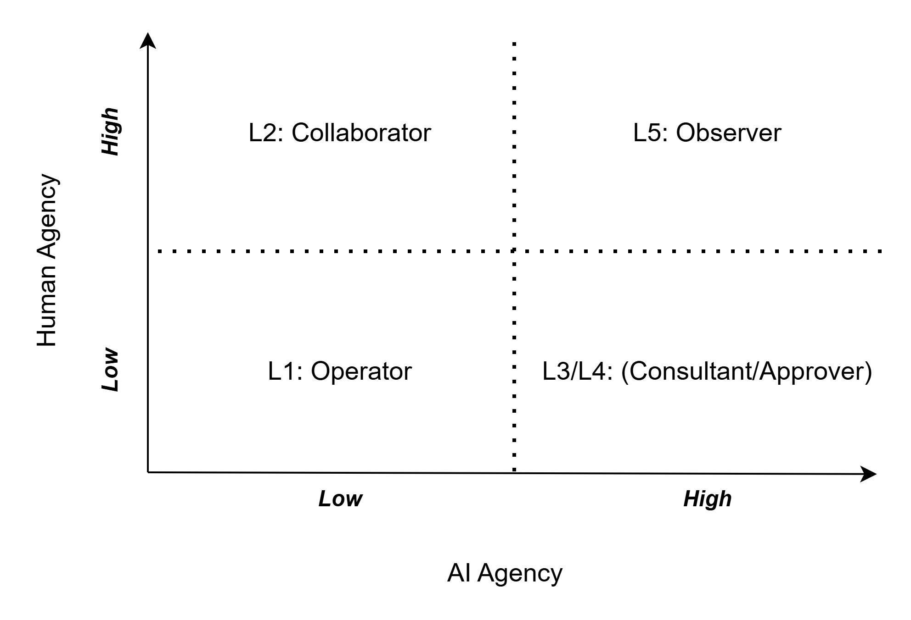

[<< **Agentic AI**](https://pranigopu.github.io/agentic-ai)

**Branched from document**: [Interpretability](https://pranigopu.github.io/agentic-ai/interpretability.html)

<h1>Autonomy Levels in Agentic AI<br><i>A Deep Analysis</i></h1>

---

> This document is based on the 5-level autonomy framework (L1–L5) and the conceptual foundation of agentic AI as given in Feng et al (2025) (link: [*Levels of Autonomy for AI Agents*, **knightcolumbia.org/content**](https://knightcolumbia.org/content/levels-of-autonomy-for-ai-agents-1)), including the hallmarks of autonomous operation, multi-step problem solving, and adaptability, as well as the problem-space categories of goal-driven planning, integration with diverse tools, and autonomous execution loops.

---

**GenAI-Use Disclaimer**: *This document has been largely generated by generative AI, but has been reviewed and edited by me, Prani Gopu. Details regarding the generation of this content have been provided below.*

> **GenAI-Use Details**: [`gen-ai-use-details`/`for-doc--autonomy-levels-in-agentic-ai`](https://pranigopu.github.io/agentic-ai/gen-ai-use-details/for-doc--autonomy-levels-in-agentic-ai.html)

---


**Contents**:

- [1. Summary Table](#1-summary-table)
- [2. AI Agency vs. Human Agency Matrix](#2-ai-agency-vs-human-agency-matrix)
- [3. Generalised Workflows by Level](#3-generalised-workflows-by-level)
  - [L1 - User as Operator](#l1---user-as-operator)
  - [L2 - User as Collaborator](#l2---user-as-collaborator)
  - [L3 - User as Consultant](#l3---user-as-consultant)
  - [L4 - User as Approver](#l4---user-as-approver)
  - [L5 - User as Observer](#l5---user-as-observer)
- [4. Levels Described by Problem Space Parameters](#4-levels-described-by-problem-space-parameters)
  - [L1 - User as Operator](#l1---user-as-operator-1)
  - [L2 - User as Collaborator](#l2---user-as-collaborator-1)
  - [L3 - User as Consultant](#l3---user-as-consultant-1)
  - [L4 - User as Approver](#l4---user-as-approver-1)
  - [L5 - User as Observer](#l5---user-as-observer-1)
- [5. Interpretability/Accountability Considerations by Level](#5-interpretabilityaccountability-considerations-by-level)
  - [Framing](#framing)
  - [L1 - User as Operator](#l1---user-as-operator-2)
  - [L2 - User as Collaborator](#l2---user-as-collaborator-2)
  - [L3 - User as Consultant](#l3---user-as-consultant-2)
  - [L4 - User as Approver](#l4---user-as-approver-2)
  - [L5 - User as Observer](#l5---user-as-observer-2)
- [6. Cross-Level Interpretability and Accountability: Principles](#6-cross-level-interpretability-and-accountability-principles)

---

# 1. Summary Table

| Level | Level Name | Essentials | Additional Considerations |
| --- | --- | --- | --- |
| **L1** | *User as Operator* | User drives all long-term planning; agent provides on-demand contextual assistance; no unsanctioned action | Suited for skill-building and high-stakes/high-expertise workflows; agent must detect when preference-based decisions are needed and pause; boundary between short-term and long-term planning must be defined |
| **L2** | *User as Collaborator* | Both user and agent plan, delegate, and execute tasks; agent can work independently in parallel; rich bidirectional communication | Suited where agent cannot reliably complete certain task classes or where user engagement has intrinsic value (e.g. skill development); task handoff and delegation UX must be carefully designed |
| **L3** | *User as Consultant* | Agent takes initiative in planning and execution over extended time horizons; user provides feedback, preferences, and directional guidance rather than direct control | Agent must know when and how to consult the user for high-quality input; user cannot directly seize control but can pause, comment, and redirect; a training/calibration period may be needed |
| **L4** | *User as Approver* | Agent operates nearly fully autonomously; user interaction limited to resolving blockers (credentials, consequential action approval, unresolvable failure states) | Heightened security concerns (credential storage, attack surface); risk of rubber-stamping from disengaged users; agent must reliably distinguish consequential from non-consequential actions |
| **L5** | *User as Observer* | Fully autonomous; no mechanism for user input during execution; user can only monitor via activity logs and trigger an emergency stop | Only appropriate in closed/sandboxed environments or where user intervention demonstrably degrades output quality; errors compound without correction; monitoring and off-switch design are critical |

---

<details><summary><b>See the original table for reference</b></summary>

</details>

# 2. AI Agency vs. Human Agency Matrix
> "Agency" is defined here: ["Autonomy, Agency and Freedom" (*Conceptual Foundation*)](https://pranigopu.github.io/agentic-ai/conceptual-foundation.html#autonomy-agency-and-freedom)

The 2 axes are:

- **Human Agency**: The degree to which the human user retains... <br> - Initiative <br> - Decision-making authority <br> - Direct control<br> ... over the workflow
- **AI Agency**: The degree to which the AI agent... <br> - plans <br> - decides <br> - acts <br> ... independently (without requiring human input)

Note that these are not perfectly inverse: L2 represents a genuinely *high-on-both* configuration, since both human and agent exercise substantial independent capability and delegate to each other. Lower levels are not simply "more human, less AI" - L1 retains full human control but uses the AI as a reactive instrument with minimal AI agency.



**NOTE**: *L3 and L4 are both high-AI-agency but differ in residual human agency. L3 preserves meaningful (if indirect) human influence; L4 reduces it to blocker resolution only. They are placed together above but should be understood as a gradient within that quadrant.*

---

**Justification for the placements in the above matrix**:

<details>
<summary><strong>L1 - Low AI Agency, High Human Agency</strong></summary>

The agent at L1 has no autonomous planning authority and takes no action without explicit user invocation. The human retains full ownership of long-term workflow direction. The AI's "agency" is reactive and narrow: it observes the user's context and responds when summoned, or at most proactively <i>suggests</i> (but never <i>executes</i> without approval). This places L1 firmly in the low-AI-agency, high-human-agency quadrant. The agent is an instrument, not a co-actor.

</details>

<details>
<summary><strong>L2 - High AI Agency, High Human Agency</strong></summary>

L2 is unique in that both axes are elevated. The agent can draft plans, execute independent sub-tasks in parallel, and make certain decisions autonomously, so there is substantial AI agency. Simultaneously, the user reviews and edits plans, decides task delegation, monitors agent progress, and can take control at any point - substantial human agency. This collaborative symmetry is the defining characteristic of L2 and makes it the only level where both parties are genuinely co-agents rather than one party subordinating to the other.

</details>

<details>
<summary><strong>L3 - High AI Agency, Moderate Human Agency</strong></summary>

The agent at L3 takes initiative in planning and execution without needing user co-execution. Human agency remains meaningful but is <i>indirect</i>: the user consults, comments, redirects, and can pause the agent, but cannot directly seize control or edit outputs in place. The shift from L2 to L3 represents a drop in human agency (from direct co-actor to strategic advisor) while AI agency rises further (agent owns the full execution thread). The human's role is more akin to a principal giving guidance to an executive than a collaborator doing shared work.

</details>

<details>
<summary><strong>L4 - High AI Agency, Low Human Agency</strong></summary>

Human agency at L4 is reduced to reactive approval: the user only engages when the agent encounters a blocker it cannot resolve, or to confirm a consequential action the agent has already decided on. The agent pre-selects formats, data sources, and analysis approaches without seeking feedback. This represents a further reduction in human agency relative to L3 - from strategic advisor to passive approver - while AI agency peaks just below full autonomy. The user's influence is minimal and largely confirmatory rather than directive.

</details>

<details>
<summary><strong>L5 - High AI Agency, Near-Zero Human Agency</strong></summary>

Human agency at L5 is effectively zero during execution. The user submits an initial request and can observe logs, but has no mechanism to redirect, pause meaningfully, or contribute input. The only human control is a binary emergency stop. The agent makes all decisions, handles all blockers independently, and iterates toward a complete output without any human involvement. AI agency is maximal. This is the only level where human agency is not merely reduced but structurally removed from the execution loop.

</details>

# 3. Generalised Workflows by Level

Each workflow below describes the interaction pattern between...

- the human (H)
- the AI agent (A)

... across the phases of a task:

`initiation -> planning -> execution -> review -> completion`

## L1 - User as Operator

```
H: Defines goal and breaks it into subtasks
|  NOTE: (long-term planning owned by human)
│
├─► H: Begins executing subtask 1
│       A: Observes context passively
│       A: Proactively suggests assistance (but does NOT act)
│       H: Accepts or ignores suggestion
│       H: Explicitly invokes A for specific support
|          (e.g. summarise, search)
│       A: Executes requested support action
│       A: Returns output to H
│       H: Reviews output, continues task
│
├─► H: Moves to subtask 2
│       [Pattern repeats]
│
└─► H: Integrates all outputs into final result
    H: Validates and completes workflow
```

**Key dynamic**: The agent follows the human's lead. Every action is either explicitly requested or, if proactively suggested, requires human approval before execution. The human never relinquishes decision authority.

## L2 - User as Collaborator

```
H: Submits goal to agent
│
A: Drafts initial plan of action
H: Reviews, edits, and approves plan
|  (may modify steps, reassign tasks)
H + A: Negotiate task delegation (who does what)
│
├─► H: Executes H-assigned subtasks independently
│
├─► A: Executes A-assigned subtasks independently
│       A: Communicates progress and blockers to H
│       H: Decides on blockers (e.g. skip inaccessible source)
│       A: Continues or adjusts based on H decision
│
H + A: Share findings in a common workspace
H: Reviews and may modify A's contributions
│
├─► [Either party may request handoff to the other mid-task]
│
└─► H + A: Collaboratively finalise output
    H: Retains override and takeover capability throughout
```

**Key dynamic**: *True parallelism. Both agents (human and AI) are executing concurrently. Communication is frequent and bidirectional. The human retains the ability to take over at any point, which means the workflow is always recoverable.*

## L3 - User as Consultant

```
H: Submits goal
│
A: Devises plan of action
H: Reviews plan, specifies changes via message/comment
A: Revises plan based on H feedback, confirms changes
│
A: Begins autonomous execution of plan
    │
    ├─► A: Reaches a decision point requiring user
    |      (i.e. user expertise or preference)
    │       A: Consults H (proactively, at chosen timing)
    │       H: Provides directional input or expert knowledge
    │       A: Incorporates feedback, continues
    │
    ├─► A: Accumulates findings in shared, viewable document
    │       H: Reviews document, adds comments/questions
    │       A: Incorporates comments into ongoing execution
    │
    ├─► H: Identifies need for course correction
    │       H: Pauses agent, requests changes
    │       A: Revises prior work if needed, resumes
    │
    └─► A: Reaches blocker
           (e.g. missing credentials, unresolvable failure)
            A: Requests H input for that specific blocker
            H: Resolves blocker
            A: Continues
│
A: Produces final output
H: Reviews completed output
```

**Key dynamic**: *The agent owns the execution thread. Human involvement is consultative and asynchronous, not concurrent. The human cannot directly edit or control the agent's process or outputs - influence is exercised through feedback and comments relayed to the agent.*

## L4 - User as Approver

```
H: Submits goal; optionally pre-specifies which action types require approval
│
A: Drafts plan of action
|  (displayed to H for transparency only, not for feedback)
│
A: Executes plan autonomously
    │
    ├─► A: Encounters credential-gated resource
    │       A: Requests credential from H
    │       H: Provides credential or instructs agent to skip
    │       A: Continues
    │
    ├─► A: Reaches consequential action
    |      (pre-flagged by H or detected by A)
    │       A: Presents proposed action + rationale to H
    │       H: Approves or rejects
    │       A: Executes or selects alternative based on response
    │
    ├─► A: Reaches unresolvable failure state
    │       A: Notifies H, requests resolution
    │       H: Does one of the following:
    |          - Provides resolution
    |          - Instructs agent to modify approach
    │       A: Continues
    │
    └─► A: Prepares final output, presents for confirmation
        H: Confirms or rejects format/structure
        A: Produces final output (or offers alternatives)
│
H: Receives completed output
```

**Key dynamic**: *The agent drives all decision-making except at structural blockers. The human's role is confirmatory and reactive. Approval interactions are infrequent, pre-defined in scope and initiated by the agent, not the human.*

## L5 - User as Observer

```
H: Submits initial goal
│
A: Drafts plan of action autonomously
A: Begins execution
    │
    ├─► A: Encounters obstacles
    |      ─► Iterates on solutions independently
    ├─► A: Dynamically revises plan based on findings
    ├─► A: Makes all data source, tool, and analysis decisions autonomously
    ├─► A: Populates running document with findings
    └─► A: Polishes and formats final output independently
│
H: Monitors activity log (read-only, no input mechanism)
│
[Emergency condition detected by H]
└─► H: Triggers emergency stop (only available intervention)
    A: Halts all activity
│
[Normal completion]
A: Delivers final output to H
H: Reviews output
```

**Key dynamic**: *The human is structurally outside the execution loop. Their only real-time capability is observation and emergency termination. All task intelligence, error handling, and decision-making belongs to the agent. The human's involvement is pre-task (goal submission) and post-task (output review), with no in-task influence pathway except the kill switch.*

# 4. Levels Described by Problem Space Parameters
> **Major context provided here**: ["Problem Spaces Agentic AI Can Handle" (*Conceptual Foundations*)](https://pranigopu.github.io/agentic-ai/conceptual-foundation.html#problem-spaces-agentic-ai-can-handle)

---

The 3 problem-space parameters...

1. **Goal-Driven Planning**
2. **Integration with Diverse Tools**
3. **Autonomous Execution Loops**

... describe the type and depth of complexity an AI agent can handle.

*Below, each level is characterised with respect to all three.*

## L1 - User as Operator
**Goal-Driven Planning**:

The agent does not engage in goal-driven planning at the workflow level. Goal decomposition into subtasks is the exclusive responsibility of the human. The agent may engage in very short-horizon, reactive micro-planning (e.g. determining how to answer a user's request for a summary), but this is incidental rather than structural. The agent lacks the planning authority to treat a high-level goal as its own and reason toward it independently.

**Integration with Diverse Tools**:

Tool use at L1 is reactive and human-directed. The agent uses tools (web search, code autocompletion, document summarisation) only when explicitly invoked by the user. The *diversity* of tool use is bounded by what the user chooses to summon. The agent is capable of tool use but does not independently select which tools to use or in what sequence, except within a single invocation.

**Autonomous Execution Loops**:

L1 does not instantiate an autonomous execution loop in any meaningful sense. The observe-orient-decide-act cycle is broken at the "act" stage without human approval. The agent observes (context-awareness), may orient (suggest), but does not decide or act autonomously. There is no self-sustaining loop: each cycle requires a human to close it.

## L2 - User as Collaborator
**Goal-Driven Planning**:

L2 introduces shared goal-driven planning. The agent can draft a plan toward a high-level goal, decompose it into ordered subtasks, and reason about task assignment. Critically, the agent's plan is subject to human revision before execution - the human retains veto authority over the plan structure. Within its assigned subtasks, the agent engages in local goal-driven planning autonomously.

**Integration with Diverse Tools**:

Tool integration at L2 is agent-directed within the scope of assigned subtasks. The agent independently selects and sequences tools to accomplish its delegated tasks. Because tasks are divided between human and agent, the agent's tool use is bounded by its sub-scope, but within that scope, it can exercise genuine tool diversity. The overall system (human + agent) achieves the broadest tool integration of any level, since both parties contribute their own tool capabilities.

**Autonomous Execution Loops**:

L2 instantiates *partial* autonomous execution loops. Within its assigned tasks, the agent cycles through the OODA/BDI loop without human involvement - observing results, adjusting approach, continuing toward sub-goals. However, the loop is porous: the human can interrupt at any time, and task handoffs break and restart the loop. The loop is autonomous within subtask scope, not across the full workflow.

## L3 - User as Consultant

**Goal-Driven Planning**:

L3 is the first level where the agent owns end-to-end goal-driven planning for the entire workflow. It decomposes the high-level goal, sequences subtasks, prioritises actions, and revises the plan dynamically as conditions change. Human input shapes the plan (via consultation and feedback) but does not co-author it in real time. The agent treats the human as an expert resource to query, rather than a co-planner.

**Integration with Diverse Tools**:

The agent independently determines which tools to use, when, and in what sequence, across the full workflow. Tool decisions are made autonomously as the plan executes. The agent may surface tool-related decisions to the user only when they require credentials, preference-based choices, or involve unfamiliar trade-offs. Tool integration is broad and agent-driven.

**Autonomous Execution Loops**:

L3 sustains a genuine autonomous execution loop across the full workflow. The OODA/BDI cycle runs continuously: the agent observes findings, re-orients its plan, decides next actions, and acts - looping until the goal is achieved or a consultation checkpoint is reached. Human consultation is *integrated into* the loop as a scheduled or triggered event, not as an external interruption of it. The loop is self-sustaining but not fully closed: human input is a designed input to the loop, not a breakdown of it.

## L4 - User as Approver

**Goal-Driven Planning**:

Goal-driven planning is fully agent-owned at L4. The agent not only plans the workflow but also makes all strategic decisions within it - which sources to trust, which data to use, how to frame conclusions - without seeking human input on those decisions. The plan is displayed to the user for transparency but is not a subject of human deliberation. Planning is autonomous, comprehensive, and proactive.

**Integration with Diverse Tools**:

L4 agents exercise the broadest tool integration of the single-agent levels (excluding L5). They independently access web resources, scholarly databases, APIs, code execution environments, and analysis tools, resolving tool access issues (e.g. paywalls, missing API keys) by either requesting credentials or adapting the approach to avoid the tool. Tool selection and sequencing are entirely agent-driven.

**Autonomous Execution Loops**:

L4 runs a robust and nearly closed autonomous execution loop. The agent observes, orients, decides, and acts across the full workflow with minimal external inputs. The loop is only broken when a structural blocker (credential, unresolvable failure, consequential action threshold) is reached - at which point the loop pauses briefly for human input, then resumes. The loop is self-correcting within its domain and adapts dynamically. Human interactions are edge cases in the loop, not structural components of it.

## L5 - User as Observer

**Goal-Driven Planning**:

Goal-driven planning at L5 is fully autonomous, dynamic, and self-correcting across the entire workflow and time horizon. The agent not only plans the initial decomposition but continuously re-plans as findings emerge, obstacles are encountered, and new information changes the landscape. No human input is incorporated into planning during execution. Planning is an ongoing internal process, not a discrete stage.

**Integration with Diverse Tools**:

Tool integration is maximal and fully autonomous. The agent selects, sequences, and substitutes tools based on real-time conditions with no human involvement. When a tool is inaccessible, the agent finds alternatives or adapts its approach. The agent may use a wider diversity of tools in a single workflow than any lower-level agent, since no human task domain is reserved.

**Autonomous Execution Loops**:

L5 instantiates a fully closed, self-sustaining autonomous execution loop. The OODA/BDI cycle runs without any designed human input pathway during execution. The agent observes its own outputs, orients to new information, decides next actions, and acts - continuously and recursively. Errors are not corrected by the human but must be caught and corrected by the agent's own internal error-handling. The loop terminates only at goal completion or emergency stop.

# 5. Interpretability/Accountability Considerations by Level

## Framing
> **Major context provided here**: ["TERMINOLOGICAL NOTE: "Interpretability" vs. "Accountability"" (*Interpretability*)](https://pranigopu.github.io/agentic-ai/interpretability.html#terminological-note-interpretability-vs-accountability)

Interpretability refers to the capacity to understand *why* an agentic system made a decision or took an action. Accountability refers to the capacity to provide reasoning/explanations for outcomes and/or to audit, reconstruct and (where necessary) remediate those outcomes. The two are related but distinct: a system can be interpretable without being accountable (if no one interprets the available information or acts on the interpretation), and nominally accountable without being interpretable (if accountability (especially the action-related part of it) is assigned by default rather than by understood causation).

Demand for interpretability/accountability increases with the level of autonomy, as (1) more decisions are made by the agent rather than the human, so more decisions require external interpretation, (2) the causal chain from user input to final output grows longer and less visible, (3) he consequences of errors compound without human correction, and (4) legal and ethical responsibility becomes harder to assign.

## L1 - User as Operator
**Problem statement considerations**:

At L1, accountability is primarily human. The agent's actions are invoked and sanctioned by the user; any output is reviewed before use. Interpretability requirements are therefore relatively low for the agent itself, since the human is co-present at every step and can interrogate outputs immediately. Safety requirements are manageable: the agent's constrained action scope limits blast radius. Validation requirements focus on the accuracy of individual AI responses (summaries, search results, code completions) rather than on workflow-level correctness.

---

**Required capacities for interpretability/accountability**:

<details><summary><b>Output-level explainability</b></summary>
The agent should be able to explain why it suggested a particular action or produced a particular output, in terms the user can verify against their own knowledge.
</details>

<details><summary><b>Source attribution</b></summary>
For any retrieved or synthesised information, the agent must cite provenance so the user can independently validate it.
</details>

<details><summary><b>Suggestion audit trail</b></summary>
Even at L1, a record of what the agent suggested (even if declined by the user) is valuable for understanding the agent's behaviour over time.
</details>

<details><summary><b>Human review as the primary accountability mechanism</b></summary>
The human's continuous presence is itself the main accountability safeguard. The agent need not have elaborate self-reporting mechanisms because the human validates at each step.
</details>

## L2 - User as Collaborator

**Problem-statement considerations**:

L2 introduces concurrent human-agent execution, which complicates accountability. When both parties contribute to a shared output, it may not always be clear which contributions came from the agent and which from the human, especially when the human modifies agent outputs. Validation requirements must therefore address the traceability of contributions. Safety requirements at L2 are moderate: the human can intervene at any point, but the agent may execute consequential sub-tasks before the human reviews them.

---

**Required capacities for interpretability/accountability**:

<details><summary><b>Contribution traceability</b></summary>
Shared documents or workspaces must track which content was generated by the agent versus the human, and must preserve a history of modifications.
</details>

<details><summary><b>Decision rationale at delegation points</b></summary>
When the agent makes delegation-related decisions (e.g. determining that a task is within its capability), it should be able to articulate the basis for that decision.
</details>

<details><summary><b>Blocker and handoff logs</b></summary>
Every blocker the agent encounters and every task handoff (in either direction) should be logged with timestamp, reason, and resolution.
</details>

<details><summary><b>Progress transparency</b></summary>
The agent's ongoing activity should be visible to the human in real time, sufficient for the human to make informed takeover decisions.
</details>

<details><summary><b>Joint accountability model</b></summary>
Because both human and agent co-produce outputs, accountability frameworks must be designed to handle shared causation; for example, distinguishing agent-generated errors from human-introduced errors in post-hoc review.
</details>

## L3 - User as Consultant

**Problem-statement considerations**:

At L3, the agent owns the execution thread, and the human's influence is indirect. This significantly increases interpretability demands: the human must be able to understand the agent's decisions without having made them. Validation requirements are more complex, since the human cannot directly audit each step in real time and must rely on the agent's own reporting. Accountability becomes more agent-facing: errors that occur between consultation checkpoints are not easily attributable to human decisions.

For high-stakes domains (legal, medical, financial), L3 requires rigorous documentation of the agent's reasoning at each consultation checkpoint, because these are the moments at which the human *could* have intervened and therefore the moments that are legally and ethically significant.

---

**Required capacities for interpretability/accountability**:

<details><summary><b>Plan-level reasoning logs</b></summary>
The agent must document not just what it planned, but why it structured the plan as it did, including what alternatives were considered and rejected.
</details>

<details><summary><b>Consultation rationale</b></summary>
Each time the agent consults the user, it must be able to articulate why it chose to consult at that moment, what it was uncertain about, and how the user's input was subsequently incorporated.
</details>

<details><summary><b>Step-by-step execution records</b></summary>
Every significant action taken during autonomous execution should be logged with sufficient detail for post-hoc reconstruction of the decision chain.
</details>

<details><summary><b>Discrepancy flagging</b></summary>
The agent should identify and flag cases where its execution diverged from the approved plan, along with the reason for divergence.
</details>

<details><summary><b>Feedback integration audit</b></summary>
When the user provides input or requests changes, the agent must log how that input was interpreted and acted upon, including whether it triggered downstream changes.
</details>

<details><summary><b>Accountability demarcation</b></summary>
At each consultation point, the record should make clear what information was available to the human and what decision or non-decision the human made - establishing a clear accountability boundary.
</details>

## L4 - User as Approver

**Problem-statement considerations**:

L4 substantially increases accountability risk. The human's engagement is minimal and reactive; there is a real risk of rubber-stamping (approving actions without genuine understanding), which can undermine accountability even when formal approval is obtained. Safety requirements are therefore high, particularly for consequential-action detection: the agent must reliably identify which of its decisions cross a threshold requiring human approval, and the human must have enough context at approval time to make a genuine decision rather than a reflexive one.

Security requirements are also elevated: the agent handles credentials and sensitive access, creating attack surfaces that must be designed against. Interpretability must be sufficient to support *meaningful* approval - an approver who cannot understand what they are approving cannot be held genuinely accountable.

---

**Required capacities for interpretability/accountability**:

<details><summary><b>Pre-approval decision briefs</b></summary>
Before requesting approval for a consequential action, the agent must provide a concise, human-readable summary of what the action is, why it is being taken, what alternatives exist, and what the risk/consequence profile is.
</details>

<details><summary><b>Consequential action classification log</b></summary>
The agent must maintain a log of every action it classified as consequential (sought approval) or non-consequential (executed autonomously), enabling post-hoc audit of whether the classification was appropriate.
</details>

<details><summary><b>Approval interaction records</b></summary>
Every approval interaction must be logged: what was proposed, what context was provided to the approver, and what the approver decided - creating a verifiable accountability trail.
</details>

<details><summary><b>Credential handling audit trail</b></summary>
All credential use must be logged with scope, purpose, and duration, and access must be revocable by the user at any time.
</details>

<details><summary><b>Engagement quality monitoring</b></summary>
Mechanisms to detect and flag low-engagement approval patterns (e.g. approval granted in under 2 seconds consistently) that may indicate rubber-stamping rather than genuine review.
</details>

<details><summary><b>Misalignment detection hooks</b></summary>
Logging and anomaly detection systems capable of identifying patterns suggestive of an agent exploiting user disengagement (e.g. progressively expanding the scope of self-authorised actions over time).
</details>

## L5 - User as Observer

**Problem-statement considerations**:

L5 places the highest possible demands on interpretability and accountability, because the human has no in-task corrective capability. Every decision the agent makes must be interpretable after the fact, since it cannot be reviewed before it is acted upon. Accountability is almost entirely agent-facing; the human's role is limited to post-hoc review and the emergency stop.

L5 should only be deployed where:

1. The problem space is well-defined enough <br> ... *such that failure modes are predictable and bounded*
2. The environment is closed or sandboxed enough <br> ... *to contain the consequences of errors*
3. Monitoring infrastructure is sophisticated enough <br> ... *to catch anomalous behaviour before errors compound irreversibly*
4. Post-hoc audit is legally and ethically sufficient <br> ... *i.e. real-time human oversight is not a regulatory requirement*

Validation requirements at L5 must be satisfied primarily through pre-deployment testing and formal verification of agent behaviour within the intended problem scope, rather than through runtime human review.

---

**Required capacities for interpretability/accountability**:

<details><summary><b>Full execution audit logs</b></summary>
Every action, decision, tool use, plan revision, and self-correction must be logged in sufficient detail to allow complete post-hoc reconstruction of the agent's reasoning and behaviour.
</details>

<details><summary><b>Decision provenance chains</b></summary>
For every significant output or decision, the agent must be able to trace back through the chain of prior observations, orientations, and decisions that led to it - enabling root cause analysis of errors.
</details>

<details><summary><b>Anomaly detection systems</b></summary>
Real-time monitoring systems (independent of the agent itself) must be capable of detecting deviating agent behaviour - unusual tool use patterns, unexpected plan deviations, resource consumption anomalies - and surfacing these to the human observer.
</details>

<details><summary><b>Emergency stop design</b></summary>
The stop mechanism must be designed with care: it must be clearly accessible, unambiguous in effect, and must preserve the agent's state at the point of termination in a form that allows investigation of what had occurred up to that point.
</details>

<details><summary><b>Pre-deployment formal validation</b></summary>
Given the absence of in-task human correction, L5 agents must be validated exhaustively prior to deployment, including red-teaming, adversarial testing, and failure mode analysis, within the intended problem scope.
</details>

<details><summary><b>Sandboxing and consequence containment</b></summary>
The execution environment must be designed to prevent unintended external consequences, and this containment must itself be auditable.
</details>

<details><summary><b>Accountability by design</b></summary>
Because no human made in-task decisions, the accountability framework must be established contractually and legally *before* deployment: who is responsible for which categories of agent error, and under what conditions.
</details>

# 6. Cross-Level Interpretability and Accountability: Principles

Across all levels, the following principles hold:

**NOTE**: *The urgency of the following increases with autonomy.*

| Principle | Description | Becomes Critical At |
|-----------|-------------|-------------------|
| **Transparency of action** | Every action taken by the agent should be logged and available for review | L3 and above |
| **Transparency of reasoning** | The agent's decision rationale, not just its decisions, must be accessible | L3 and above |
| **Accountability demarcation** | Clear records of what the human knew, decided, and approved at each human-agent interaction point | All levels; highest at L4 |
| **Provenance of outputs** | Any claim, data point, or conclusion in the agent's output must be traceable to its source | All levels |
| **Consequential action identification** | The agent must reliably classify which of its actions cross thresholds requiring human involvement | L3 and above |
| **Error containment** | Agent errors should not cascade beyond the scope the human can recover from without external harm | Critical at L4–L5 |
| **Audit completeness** | The record must be sufficient for a third party to reconstruct what happened and why, without access to the human's memory | L3 and above; mandatory at L5 |
| **Meaningful human engagement** | Where human approval is required, the human must have sufficient context to make a genuine decision | Critical at L4 |