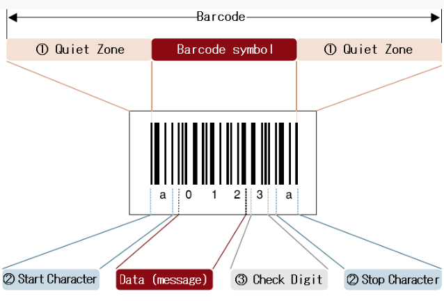

<head>
  <script>
    MathJax = {tex: {inlineMath: [['$', '$']]}};
  </script>
  <script id="MathJax-script" async
    src="https://cdn.jsdelivr.net/npm/mathjax@3/es5/tex-chtml.js">
  </script>
</head>

<h1>Applications of Number Theory</h1>

---

**Contents**:

- [Pseudorandom numbers](#pseudorandom-numbers)
  - [Random numbers](#random-numbers)
  - [Pseudorandom numbers](#pseudorandom-numbers-1)
  - [Pseudorandom number generation (pRNG)](#pseudorandom-number-generation-prng)
  - [Some applications of pRNG](#some-applications-of-prng)
    - [Video game encounters](#video-game-encounters)
    - [End-to-end encryption](#end-to-end-encryption)
  - [Demonstrating some basic pRNGs](#demonstrating-some-basic-prngs)
    - [Middle squares method](#middle-squares-method)
- [Hash function](#hash-function)
  - [Definition and associated terms](#definition-and-associated-terms)
  - [Properties of an ideal hash function](#properties-of-an-ideal-hash-function)
    - [Non-invertibility](#non-invertibility)
    - [Collision resistance i.e. one-to-one property](#collision-resistance-ie-one-to-one-property)
    - [Second pre-image resistance](#second-pre-image-resistance)
  - [Design and implementation](#design-and-implementation)
  - [Demonstration](#demonstration)
    - [Creating a basic hash function](#creating-a-basic-hash-function)
    - [Creating a basic hash map](#creating-a-basic-hash-map)
- [Parity bit method](#parity-bit-method)
  - [Context](#context)
  - [Definition](#definition)
  - [Basic parity bit method](#basic-parity-bit-method)
    - [Demonstration](#demonstration-1)
      - [Helper functions](#helper-functions)
      - [Application](#application)
  - [Hamming code](#hamming-code)
    - [Some results](#some-results)
    - [Demonstration](#demonstration-2)
      - [General helper functions](#general-helper-functions)
      - [Hamming-code-specific helper functions](#hamming-code-specific-helper-functions)
      - [Application](#application-1)
- [Cryptography](#cryptography)
  - [Definition and associated terms](#definition-and-associated-terms-1)
    - [Cryptosystem and its components](#cryptosystem-and-its-components)
    - [Cryptography classification](#cryptography-classification)
  - [Private and public keys](#private-and-public-keys)
    - [Private keys and symmetric cryptography](#private-keys-and-symmetric-cryptography)
    - [Public keys and asymmetric cryptography](#public-keys-and-asymmetric-cryptography)
  - [Rivest-Shamir-Adleman algorithm](#rivest-shamir-adleman-algorithm)
    - [Obtaining the public and private keys](#obtaining-the-public-and-private-keys)
      - [Introduction to the problem](#introduction-to-the-problem)
      - [Using the Carmichael function](#using-the-carmichael-function)
      - [Obtaining e and d](#obtaining-e-and-d)
    - [Obtaining the ciphertext](#obtaining-the-ciphertext)
    - [Message partitioning](#message-partitioning)
  - [Demonstrating RSA](#demonstrating-rsa)
    - [Key generation](#key-generation)
    - [Helper functions](#helper-functions-1)
    - [Plaintext partitions](#plaintext-partitions)
    - [Plaintext conversion to reversible integers](#plaintext-conversion-to-reversible-integers)
    - [Encryption (obtaining ciphertext from plaintext)](#encryption-obtaining-ciphertext-from-plaintext)
    - [Decryption (obtaining plaintext from ciphertext)](#decryption-obtaining-plaintext-from-ciphertext)
- [Barcode scanning](#barcode-scanning)
  - [Barcode definition and purpose](#barcode-definition-and-purpose)
  - [Barcode components](#barcode-components)
- [Coding and decoding](#coding-and-decoding)
  - [Definition and purpose](#definition-and-purpose)
  - [Caesar cipher](#caesar-cipher)
      - [Assumptions, definitions and notations](#assumptions-definitions-and-notations)
    - [Encoding implementation](#encoding-implementation)
      - [CASE 1](#case-1)
      - [CASE 2](#case-2)
    - [Decoding implementation](#decoding-implementation)
      - [CASE 1](#case-1-1)
      - [CASE 2](#case-2-1)
    - [Demonstration](#demonstration-3)
      - [Encoding](#encoding)
      - [Decoding](#decoding)
  - [Randomised or arbitrary one-to-one coding](#randomised-or-arbitrary-one-to-one-coding)
  - [References](#references)

---

# Pseudorandom numbers
## Random numbers
A random number is a measurement taken from a random i.e. non-deterministic process. i.e. a process whose future behaviour cannot be predicted with certainty. Hence, in general, a sequence of random numbers cannot be expressed as a generalised formula. Instead, a sequence of random numbers is defined using a probability distribution that associates possible value (that can be drawn from the process) to its probability of occurrence (i.e. the probability that the value occurs at any given point in time in the random process). A sequence of numbers is said to be random if:

- Each number has equal probability of occurrence (uniformity)
- Any past value has no effect in determining the current value (independence)

## Pseudorandom numbers
In theory, due to causality, a truly random process may not exist. In practice, randomness is determined by unpredictability from a realistic perspective, where there are constraints on time and computational capacity. Hence, if a sequence possesses a sufficiently complicated pattern (often involving too many unaccountable factors) such that this pattern cannot or will not be realistically determined in a given situation, it may be considered random. Computation is a deterministic process, hence its results are predictable, fundamentally. However, at a sufficient complexity, a computational process and its results can be practically unpredictable for the given purposes.

## Pseudorandom number generation (pRNG)
pRNG involves one arbitrary input, known as the seed. The seed is the starting point of the pRNG, and may be the starting point of the sequence itself. A computational (mathematical) algorithm is applied in the seed to generate the pseudorandom sequence one number at a time. This process is usually recursive (i.e. using the previously generated number as an input to generate the next number), but it may simply a function of the seed, which is not preferred, since such a pattern is usually easier to crack.


1.<br>
A sequence generated using a given seed for a given algorithm can be reproduced using the same seed for the same algorithm. Hence, the level of randomness of the pseudorandom sequence is dependent on the initial seed.


2.<br>
A pseudorandom sequence containing values with a fixed maximum number of digits must eventually repeat, since the number of possible values that an occur in the sequence is finite, and eventually, a previously used seed will be encountered and reused (leading to a previously produced sequence of values). The length of the longest repeated sequence in a pRNG is called the period of the pRNG. Note that this repeated sequence may be not include the seed and some or many of the previously generated pseudorandom numbers.


The above points 1 and 2 clearly show that pseudorandom numbers are deterministic, fundamentally. However, this deterministic quality combined with the simulated randomness has many useful applications, which may not only rely on the practical unpredictability of the pRNG, but may also rely on the reproducibility of a pseudorandom sequence.

## Some applications of pRNG
### Video game encounters
In many video games, such as Minecraft, a player's experience is randomised to some degree, using pRNG. For example, it may be used to randomise the behaviour of certain NPCs (non-playable characters), the loot obtained in certain treasure chests, the drops obtained by mining a resource, etc. This often makes the game more engaging, since the player's experience is not entirely predictable, and he or she is compelled to adapt and improvise to varying degrees. Furthermore, since the pRNG is reproducible, the game can be designed in a way that the current game world produces the same outcomes for given actions or encounters for the player, if the player were to try to reload the game or go to a previous checkpoint.

### End-to-end encryption
End-to-end encryption is a method to ensure that data shared between two users' devices cannot be intercepted and accessed by a third-party. This involves the following steps:

- Obtaining a common seed for pRNG, for the two devices only
- Generating a new secret key using pRNG to encrypt the new message<br> (Since the sender's and receiver's pRNG start from the same seed, they obtain the same secret key)
- Generating the same secret key using pRNG to decrypt the new message
- Deleting the secret keys from in device

This involves generating a secret key for each message in the sender's and receiver's separately.

## Demonstrating some basic pRNGs
### Middle squares method
This pRNG involves the following steps:

1. Let $x$ = seed, where seed is some value of $n$ digits
2. Assign $x$ = middle $n$ digits of $c+x^2$, where $c$ is some constant
3. Save x to the list of generated pseudorandom numbers $R$
4. Go to step 2

```python
# Simple generator
def middleSquares(seed, upper, size):
    R = [seed] # List of generated numbers
    size //= 2
    """
    'size' is the size of the central i.e. middle substring
    that we extract from the numerical strings of our generated numbers.
    Doing size = size // 2 above helps define the middle index interval
    from which we extract the middle of the string.
    For example, if size is given as 5, size = size // 2 => size is 2.
    Hence, our middle index interval becomes [mid-2, mid+2], where
    mid is the middle index of the string.
    """
    
    x, i = seed, 1
    while i < upper:
        x = str(123 + x**2) # Getting the numerical string
        mid = len(x) // 2 # Getting the middle index of the numerical string
        x = int(x[mid-size:mid+size+1]) # Extracting the middle of the string
        """
        The middle index interval from which we extract is
        [mid-size, mid+size])
        """
        
        R.append(x) # Appending newly generated number in the list
        i += 1
    return R

# Generator that stops when sequence starts repeating (no given upper bound)
def middleSquaresDistinct(seed, size):
    R = {seed: 0} # Dictionary of generated (key is generated number, value is index)
    size //= 2
    x, i = seed, 1
    while True:
        x = str(123 + x**2)
        mid = len(x) // 2
        x = int(x[mid-size:mid+size+1])
        try:
            x = R[x]
            """
            If we can obtain a value for the key 'x'
            i.e. the currently generated pseudorandom
            number, that means the number already exists
            in the dictionary as a key, hence
            no ValueError exception will be thrown.
            Hence, we end the function and return the dictionary.
            """
            
            return {"distinctValues": list(R.keys()),
                    "repeatStart": x,
                    "period": i - x}
        except: R[x] = i
        i += 1
```

Example and comparison between the above two functions...

```python
A = middleSquares(52, 13, 3)
B = middleSquaresDistinct(52, 3)

print("SIMPLE MIDDLE SQUARES METHOD RESULTS\n")
print(A)
print("------------")
print("MIDDLE SQUARES METHOD RESULTS WITH DISTINCTNESS\n")
for i in B.items():
    print(i[0])
    print(i[1])
    print()
```

```
SIMPLE MIDDLE SQUARES METHOD RESULTS

[52, 827, 405, 414, 151, 292, 538, 956, 405, 414, 151, 292, 538]
------------
MIDDLE SQUARES METHOD RESULTS WITH DISTINCTNESS

distinctValues
[52, 827, 405, 414, 151, 292, 538, 956]

repeatStart
2

period
6
```

# Hash function
## Definition and associated terms
A hash function is a function that maps given data of arbitrary size to a single value that has fixed size limit. Applying a hash function on data is called "hashing the data". The return value of a hash function is called a hash value. In some implementations, the hash value is of fixed length.


Since hashing often involves converting any input into a hash value of limited (often smaller) size, hash functions may be called "compression functions". For a similar reason, a hash value is also called a message digest.

## Properties of an ideal hash function
### Non-invertibility
It should be computationally difficult to find the inverse of a hash function, i.e. given a hash value, the corresponding input must be difficult to compute. In other terms, if $h$ is the hash function, $h(x)=z$, and only $z$ is known, $x$ must be difficult to compute.

### Collision resistance i.e. one-to-one property
The mapping of two or more inputs to the same hash value i.e. collisions must be rare, and ideally impossible. In other terms, it must be difficult to find two inputs $x$ and $y$ such that $h(x)=h(y)=z$. However, since inputs are of arbitrary length while hash values are of limited length, collisions are impossible to eliminate entirely.

### Second pre-image resistance
This is related to collision resistance, but here we specify that _given an input and hash value pair_, it should be computationally difficult to find another input that has the same hash value. In other terms, given a hash value $z$ for a pre-image $x$ i.e. for $h(x)=z$, it must be difficult to obtain another pre-image $y \neq x$ such that $h(y)=z$. Note that collision resistance implies second pre-image resistance.

## Design and implementation
At the most basic level, a hash function can simply operate on an input to produce an output that has a fixed size limit. Now, note that hash functions are often used for creating hash tables (also called hash maps). Hash tables are arrays that can associate a key to a value. Hence, we can use the hash value of a given input to perform a direct lookup in the table, to see

- Whether the given input is a key that exists for the hash map
- What values correspond to the given key


For this purpose, the hash value must be a sufficiently small integer that can serve as an index in the hash table. With this in mind, we will follow two steps in the creation of the hash function:

- Map a key to an integer
- Map the integer to a bucket i.e. a sufficiently small positive integer

## Demonstration
### Creating a basic hash function
```python
hashTableSize = 100
def integerToBucket(x):
    tmp = x % hashTableSize
    if tmp == 0: return x % (hashTableSize // 2 + 1)
    return tmp
def keyToInteger(x):
    z = 0
    # If x is an integer, apply 'integerToBucket' directly.
    # Otherwise, carry on.
    try: return int(x)
    except: pass
    # Calculating integer for given input
    for i in x: z = z*ord(i) + ord(i)**2
    return z

# Main hashing function
def h(x):
    return integerToBucket(keyToInteger(x))
```

---

```python
print(h("Hello, I am a gummy bear."))
print(h("Hello world"))
print(h("I love democracy, I love the republic."))
```

```
68
4
92
```

### Creating a basic hash map
```python
hashTableSize = 100
def createHashMap(items):
    # Every item must be a tuple, where the first value is the key.
    hashMap = ['-']*hashTableSize
    for item in items:
        i = h(item[0])
        # Checking if hashMap at index i is empty.
        # If yes, insert freely (as a singleton list).
        # If no, append the item in a list at that index.
        if hashMap[i] == '-': hashMap[i] = [item[1]]
        else: hashMap[i].append(item)
    return hashMap
```

Obtaining hash map...

```python
items = [
    ('Pranav', 12),
    ("Vanaris", 41),
    ("Coule", 14),
    ("Mina", 51),
    ("Heresh", 59)]
hashMap = createHashMap(items)
```

Referencing...

```python
print(hashMap[h("Vanaris")])
print(hashMap[h("Coule")])
print(hashMap[h("Heresh")])
print(hashMap[h("Huang")])
```

```
[41]
[14]
[59]
-
```

# Parity bit method
## Context
Digital data is stored, processed and transmitted as binary information i.e. information encoded using only two units, conventionally represented as 0 and 1. Our concern is with data transmission. Due to factors such as noise or distortion, the data sent may not match the data received. In binary data, this means that certain 0's may become 1 or certain 1's may become 0. The deviation between the sent data and received data is the error. We have multiple methods error detection, and parity bit method is one of them.

## Definition
Parity bit method is a method to detect single bit errors i.e. when the sent data and received data differ by only one bit (this method may fail for multiple bit errors). In this method, the receiver checks whether the number of 1's in the received data is even or odd. For even parity check, the data is considered correct only if the number of 1's is even, and correspondingly for odd parity check. To enable such a parity check, the sender appends a parity bit to the data it sends. For even parity check, the sender sets the parity bit such that the number of 1's including the parity bit is even, and correspondingly for odd parity check.


In other terms, the parity bit can be defined as $n \bmod 2$, where $n$ is the sum of the binary digits of the message (hence, $n$ is the number of 1's in the message).

## Basic parity bit method
Here, a parity bit is simply appended after the data bit sequence, based on the number of ones in the binary data i.e. the sum of the binary digits.

### Demonstration
#### Helper functions
```python
# Functions to convert message to binary using binary conversion of ASCII values
# Converting decimal to binary
def decToBin(n):
    b = ''
    while n > 0:
        b = str(n % 2) + b
        n //= 2
    return b
# Converting string to binary
def stringToBin(s):
    b = ''
    for c in s:
        # Binary representation of character
        k = decToBin(ord(c))
        # Padding the binary representation to have 7 digits
        for i in range(0, 7 - len(k)):
            k = '0' + k
        # Adding to binary message
        b +=  k
    return b
#====================================
# Functions to check the actual message in character form
# Converting binary to decimal
def binToDec(b):
    n, multiplier = 0, 1
    for i in range(-1, -len(b) - 1, -1):
        n += multiplier*int(b[i])
        multiplier *= 2
    return n
# Converting binary to text string
def binToString(b):
    s = ""
    for i in range(0, len(b) - 6, 7):
        # Obtaining the character for the binary number
        c = chr(binToDec(b[i:i+7]))
        # Adding to string
        s += c
    return s
#====================================
# Function to get parity bit for a given message
def sumOnes(s):
    # NOTE: We assume s is the message in binary form!
    #------------------------
    totalOnes = 0
    for c in s:
        totalOnes += int(c)
    return totalOnes
def getParityBit(s):
    s = stringToBin(s)
    totalOnes = sumOnes(s)
    parityBit = totalOnes % 2
    return parityBit
#====================================
# Function to simulate single bit error
from random import randint
def errorify(s):
    # NOTE: We assume s is the message in binary form!
    #------------------------
    # Choosing a random bit to change
    i = randint(0, len(s) - 1)
    # Creating error
    s = s[:i] + str((int(s[i]) + 1) % 2) + s[i+1:]
    """
    str((int(s[i]) + 1) % 2) converts 1 to 0 and 0 to 1.
    """
    return s
```

Testing the above...

```python
print(decToBin(13))
print(stringToBin("Hi"))
print("------------")
print(binToDec("1011011"))
print(binToString(stringToBin("Hi")))
print("------------")
print(sumOnes(stringToBin("Hi")))
print(getParityBit("Hi"))
print("------------")
x = errorify(stringToBin("Hi"))
print(x)
print(binToString(x))
```

```
1101
10010001101001
------------
91
Hi
------------
6
0
------------
10010001001001
HI
```

#### Application
Message sent with parity...
```python
# Plaintext message
txt = "Hola, senor"
# Appending parity bit to binary form of the message
msg = stringToBin(txt) + str(getParityBit(txt))
print("Intended message in plaintext form:")
print(binToString(msg[:-1]))
print("Intended message in binary form:")
print(msg)
print()
```

```
Intended message in plaintext form:
Hola, senor
Intended message in binary form:
100100011011111101100110000101011000100000111001111001011101110110111111100101
```

---

Simulating single bit error...

```python
corrupted = errorify(msg)
print("Corrupted message in plaintext form:")
print(binToString(corrupted[:-1]))
print("Corrupted message in binary form:")
print(corrupted)
```

```
Corrupted message in plaintext form:
Hola, senoz
Corrupted message in binary form:
100100011011111101100110000101011000100000111001111001011101110110111111110101
```

---

Message received...

```python
# Checking for error
if (sumOnes(corrupted[:-1]) % 2) == int(corrupted[-1]):
    print("No single bit error detected.")
else:
    print("Single bit error detected.")
```

```
Single bit error detected.
```

---

To verify that the detection works, we will test it with the uncorrupted message...

```python
# Checking for error
if (sumOnes(msg[:-1]) % 2) == int(msg[-1]):
    print("No single bit error detected.")
else:
    print("Single bit error detected.")
```

```
No single bit error detected.
```

## Hamming code
Hamming code is the utilisation of parity bits to make the error detection more precise and even enable some error correction. The idea of Hamming code is that instead of using one parity bit for the whole data, we use multiple parity bits that help detect errors in different sections of the data. The algorithm of Hamming code is as follows...

- Obtain the bit positions starting from 1 in binary form<br>(1, 10, 11, 100...)
- Bit positions that are powers of 2 are marked as parity bits<br>(1, 2, 4, 8...)
- Other bit positions are marked as data bits

Each parity bit is meant for the following sequences...

- Parity bit 1 covers all the bits positions whose binary representation has 1 in the least significant position<br>(1, 3, 5...)
- Parity bit 2 covers all the bits positions whose binary representation has 1 in the 2nd position from the least significant bit<br>(2, 3, 6...)
- Parity bit 4 covers all the bits positions whose binary representation has 1 in the 3rd position from the least significant bit<br>(4, 5, 6...)
- Parity bit 8 covers all the bits positions whose binary representation has 1 in the 4th position from the least significant bit bits<br>(8, 9, 10...)

In general, each parity bit covers all bits where the bitwise and of the parity position and the bit position is non-zero. Keep adding parity bits as long as the last parity bit position is before at least one data bit. Note that parity bits are omitted from the count of 1's, so whenever they are encountered, just ignore and move on.

### Some results
Define the following:

- $r$ is the number of parity bits required for a data sequence
- $m$ is the number of data bits

Now, notice that

- Parity bit 1 is in position $1=2^0$
- Parity bit 2 is in position $2=2^1$
- Parity bit 3 is in position $4=2^2$
- Parity bit 4 is in position $8=2^3$

Hence, in general, parity bit $k$ is in the position $2^{k-1}$. Hence, the last parity bit i.e. parity bit $r$ is in the position $2^{r-1}$. The fact that this is the last parity bit means that $2^{r-1}$ is the last power of 2 that is less than the size of the whole message (message includes the data bits and parity bits). Hence, $2^r$ is the first power of 2 that is greater than the size of the whole message. Now, note that the size of the message is given by $m+r$. Hence,

$2^r > m+r$

$\implies 2^r \geq m+r+1$

We will use this result to insert the right amount of redundant i.e. parity bits to the sequence of data bits as we create the whole message.

### Demonstration
#### General helper functions
The following have been defined previously...

```python
# Functions to convert message to binary using binary conversion of ASCII values
# Converting decimal to binary
def decToBin(n):
    ...
# Converting string to binary
def stringToBin(s):
    ...
#====================================
# Functions to check the actual message in character form
# Converting binary to decimal
def binToDec(b):
    ...
# Converting binary to text string
def binToString(b):
    ...
#====================================
# Function to simulate single bit error
from random import randint
def errorify(s):
    ...
```

Testing above functions...

```python
print(decToBin(13))
print(stringToBin("Hi"))
print("------------")
print(binToDec("1011011"))
print(binToString(stringToBin("Hi")))
print("------------")
x = errorify(stringToBin("Hi"))
print(x)
print(binToString(x))
```

```
1101
10010001101001
------------
91
Hi
------------
10110001101001
Xi
```

#### Hamming-code-specific helper functions
```python
# Inserting redundant bits among data bits
def insertRedundantBitPositions(s, printInfo=False):
    """
    printInfo is an optional boolean argument.
    It is only used to enable code output demonstration.
    By default, it is false.
    """
    
    # Converting to binary form
    s = stringToBin(s)
    # Converting string to list (of 1's and 0's)
    s = list(s)
    #------------------------
    # Inserting redundant bits at positions of power 2
    # Inserting parity bits at positions of power 2
    t = []
    cur = 1 # Current redundant bit position
    prev = 0 # Previous redundant bit position
    redundantBitCount, i = 0, 0
    """
    In Hamming code,
    2^r >= m+r+1, where
    m => number of data bits
    r => number of redundant bits
    
    Hence, we need to keep adding
    redundant bits until 2^r >= m+r+1.
    Hence, while 2^r < m+r+1,
    we need to keep adding redundant bits
    """
    while 2**redundantBitCount < (len(s) + redundantBitCount + 1):
        # Appending data bits between two redundant bit positions
        """
        Note that we place data bits until the next
        redundant bit. To do this, the data bit index,
        i, must rise within the bounds of the current
        and previous redundant bits.
        
        Since in this code the redundant are given as
        positions (for calculation reasons) while an array
        index is essentially position-1
        (i.e. position 1 => index 0, etc.),
        we subtract 1 from the difference cur-prev to
        provide a limited increase for the data bit index.
        
        Note that cur-prev-1 provides the upper bound to
        the increase in i from its current value.
        Hence, the actual upper bound for i would be
        i + cur-prev-1.
        """
        upper = i + cur-prev-1
        while i < upper:
            try:
                t.append(s[i])
                i += 1
            except:
                """
                Exception occurs if all data bits
                have been added to the list t.
                """
                return (t, positions)
        
        # Appending redundant bit position
        t.append(" ")
        
        # Changing variables
        redundantBitCount += 1
        prev = cur
        cur *= 2
    #------------------------
    # Appending the remaining data bits
    while i < len(s):
        t.append(s[i])
        i += 1
    #------------------------
    # Printing data for reference
    if printInfo:
        print("Ordered list of data bits among redundant bits:")
        print(t)
        print("Redundant bit count:", redundantBitCount)
    #------------------------
    return (t, redundantBitCount)
#=====================================
# Inserting parity bits in the redundant bit positions
# Inserting number of ones in the respective positions for each redundant bit
def insertTotalOnes(s, printInfo=False):
    """
    printInfo is an optional boolean argument.
    It is only used to enable code output demonstration.
    By default, it is false.
    """
    
    # Obtaining list of data bits and redundant bits
    # as well as redundant bit count
    s, redundantBitCount = insertRedundantBitPositions(s)
    # Getting array of positions (position = index + 1)
    positions = list(range(1, len(s)+1))
    # Printing for demo purposes
    if printInfo:
        print("Positions in binary form (for reference):")
        print(list(map(decToBin, positions)))
    #------------------------
    cur = 1 # Current redundant bit position
    for i in range(0, redundantBitCount):
        # Totalling ones from every position
        # (whose binary form has 1 in the ith place)
        """
        ith place => ith position from the right
        """
        totalOnes, nextRedundantBitPosition = 0, 1
        for j in range(0, len(positions)):
            # Skipping next redundant bit position's corresponding index
            if j == nextRedundantBitPosition-1:
                nextRedundantBitPosition *= 2
                continue
            # Checking if the least significant binary digit is 1
            if positions[j]&1 == 1:
                totalOnes += int(s[j])
            # Shifting position number to the right
            # (i.e. dividing by 2)
            """
            This is to move to the next least
            significant digit in the binary
            representation of the position number.
            """
            positions[j] = positions[j]>>1
        s[cur-1] = totalOnes
        cur *= 2
    #------------------------
    # Printing data and filled redundant bit list for reference
    if printInfo:
        print("Ordered list of data and filled redundant bits:")
        print(s)
    #------------------------
    return (s, redundantBitCount)

# Obtaining the parity bits
def insertParityBits(s, printInfo=False):
    s, redundantBitCount = insertTotalOnes(s)
    cur = 1 # Current redundant/parity bit position
    for i in range(0, redundantBitCount):
        s[cur-1] %= 2
        # Converting to string for demo purposes
        s[cur-1] = str(s[cur-1])
        cur *= 2
    #------------
    # Printing data and parity bit list for reference
    if printInfo:
        print("Ordered list of data and parity bits:")
        print(s)
    return s
#=====================================
# Functions to check the actual message in character form
def getDataBits(s):
    dataBits = []
    nextRedundantBitPosition = 1
    for j in range(0, len(s)):
        # Skipping next redundant bit position's corresponding index
        if j == nextRedundantBitPosition-1:
            nextRedundantBitPosition *= 2
            continue
        # Checking if the least significant binary digit is 1
        dataBits.append(s[j])
    return dataBits
#=====================================
# Function to detect single bit errors using Hamming code parity bit method
def detectError(s):
    positions = list(range(1, len(s)+1))
    cur = 1 # Current parity bit position
    while cur <= len(s):
        # Totalling ones from every position
        # (whose binary form has 1 in the ith place)
        """
        ith place => ith position from the right
        """
        totalOnes = 0
        for j in range(0, len(positions)):
            totalOnes, nextRedundantBitPosition = 0, 1
        for j in range(0, len(positions)):
            # Skipping next redundant bit position's corresponding index
            if j == nextRedundantBitPosition-1:
                nextRedundantBitPosition *= 2
                continue
            # Checking if the least significant binary digit is 1
            if positions[j]&1 == 1:
                totalOnes += int(s[j])
            # Shifting position number to the right
            # (i.e. dividing by 2)
            """
            This is to move to the next least
            significant digit in the binary
            representation of the position number.
            """
            positions[j] = positions[j]>>1
        
        if (totalOnes % 2) != int(s[cur-1]):
            print("Single bit error detected for parity bit", cur)
            return True
        cur *= 2
    print("No single bit error detected.")
    return False'
```

Testing to above functions...

```python
print(stringToBin("H"))
x = insertRedundantBitPositions("H", True)
print("------------")
x = insertTotalOnes("H", True)
print("------------")
x = insertParityBits("H", True)
print("------------")
print("Getting back the data bits:")
getDataBits(x)
```

```
1001000
Ordered list of data bits among redundant bits:
[' ', ' ', '1', ' ', '0', '0', '1', ' ', '0', '0', '0']
Redundant bit count: 4
------------
Positions in binary form (for reference):
['1', '10', '11', '100', '101', '110', '111', '1000', '1001', '1010', '1011']
Ordered list of data and filled redundant bits:
[2, 2, '1', 1, '0', '0', '1', 0, '0', '0', '0']
------------
Ordered list of data and parity bits:
['0', '0', '1', '1', '0', '0', '1', '0', '0', '0', '0']
------------
Getting back the data bits:

['1', '0', '0', '1', '0', '0', '0']
```

#### Application
Message sent with parity bits using Hamming code...

```python
txt = "Hola, senor"
msg = insertParityBits(txt)
print("Intended message in plaintext form")
print(binToString(''.join(getDataBits(msg))))
print("Intended message in binary form:")
print(''.join(msg))
```

```
Intended message in plaintext form
Hola, senor
Intended message in binary form:
001100110001101111111011001100010101011000100000111001111001011010111011011111110010
```

Simulating single bit error...

```python
corrupted = list(errorify(''.join(msg)))
print("Corrupted message in plaintext form")
print(binToString(''.join(getDataBits(corrupted))))
print("Corrupted message in binary form:")
print(''.join(corrupted))
```

```
Corrupted message in plaintext form
Iola, senor
Corrupted message in binary form:
001100110011101111111011001100010101011000100000111001111001011010111011011111110010
```

_Note that it may happen that no data bits were corrupted, but instead, one parity bit was changed. In this case, however, it was a data bit that was corrupted._

Message received...

```python
detectError(corrupted)
```

```
Single bit error detected for parity bit 1

True
```

To verify if the detection works, we will test it with the uncorrupted message...

```python
detectError(msg)
```

```
No single bit error detected.

False
```

# Cryptography
## Definition and associated terms
Cryptography is the study and practice of secure communication techniques wherein the message's contents can only be viewed by the sender(s) and intended receiver(s) (_"kryptos"_ $\implies$ _hidden_). An interceptor is an unauthorised entity who can access the transmitted data (but may not be able to read the message itself).

### Cryptosystem and its components
A cryptosystem (also called cipher system) is an implementation of cryptographic techniques, and involves the accompanying infrastructure. A basic cryptosystem has the following components:

- Plaintext
- Encryption key
- Encryption algorithm
- Ciphertext
- Decryption algorithm
- Decryption key

Plaintext is the data to be messaged. Encryption key is a value known by the sender. Encryption algorithm is a computational process whose inputs are the plaintext and the encryption key, and whose output is the ciphertext, which is a transformed version of the plaintext (_note that the ciphertext may be accessed by any interceptor who has access to the communication channel_). Decryption algorithm is a computational process whose inputs are the ciphertext and the decryption key, and whose intended output is the plaintext. Decryption key is a value known by the receiver, and related to the encryption key such that when it is applied to the decryption algorithm, it transforms the ciphertext back to the plaintext.

### Cryptography classification
Cryptography can be classified into the following categories:

- Symmetric cryptography
- Asymmetric cryptography
- Hashing (discussed separately)

**NOTE 1: Symmetric vs. asymmetric key cryptography**:<br>In symmetric cryptography, the decryption key and encryption key are identical. In asymmetric cryptography, they differ, but are still related to each other, since the decryption key must be made with respect to the encryption key to enable decryption, because that the encryption key plays a major role in shaping the ciphertext.

**NOTE 2: Key space**:<br>In asymmetric cryptography, there can be multiple decryption keys provided to different receivers. The set of all possible decryption keys that can be provided for a given cryptosystem is called the key space of the cryptosystem. This becomes relevant when we discuss public keys.

## Private and public keys
### Private keys and symmetric cryptography
A private key is a key used in symmetric cryptography, hence is used for both encryption and decryption. It is private i.e. known only to the sender and receiver, and kept secret. For example, the end-to-end encryption (discussed in the pseudorandom numbers chapter) in a messaging service such as WhatsApp uses private keys that are known only by the two or more parties of a chat. _Note that in this example, the private keys change for every message, based on a pseudorandom sequence generated separately by each device registered in the chat._

### Public keys and asymmetric cryptography
A public key is an encryption key that is publicly visible in a network, and is associated with a particular member of the network. This public key is used to encrypt messages intended for the particular member, who then uses a different private decryption key to decrypt the message. Since the encryption and decryption keys differ, this is asymmetric cryptography.

To understand public keys, consider the following situation. Let's say we own a network with multiple people connected to it. To make our network secure i.e. resistant to interception of messages, we want to use encryption and decryption to ensure that only the intended receiver can read the message. However, we also have the following desires for the network:

- Anyone can communicate with anyone else in the network
- A new member can be easily added to the network
- Establishing a secure communication must be automatic and seamless

If we were to use private keys, then everyone would need to know everyone else's private keys, and hence, the network would not be secure. Hence, we create a system wherein:

- Every device has its own public encryption key visible to other members
- A message is encrypted using the public key of the intended receiver
- A message is decrypted locally using a different private decryption key

A member's public encryption key must be such that a message encrypted using this key can only be decrypted by this member's own decryption key. Furthermore, since the decryption keys are private and different from the public keys, no one should be able to read messages intended for someone else, since they do not have the required decryption key.

## Rivest-Shamir-Adleman algorithm
RSA is a public key cryptosystem that is widely used today to ensure secure digital communications. The basic idea behind it is as follows...

Let $m$ be a given positive integer, and let $e$, $d$ and $n$ (where $n>m$) be large positive integers that satisfy the congruence $(m^e)^d \equiv m \pmod n$ (i.e. the remainder of $(m^e)^d/n$ is the same as the remainder of $m/n$). If  $e$ and $n$ are large numbers, it can be extremely difficult to deduce  $d$for a given  $m$, even if $e$, $m$ and $n$ are known. This is the basis of RSA algorithm. In this algorithm, we have


- $p$ and $q$ are two distinct large primes (which are kept secret)
- $m$ as the reversible integer of the original message constructed in a way such that $m$ is divisible by neither $p$ nor $q$ (reversible $\implies$ original string can be reliably obtained)
- $n$ (where $n>m$) is the product of $p$ and $q$
- $(n, e)$ is the public encryption key
-  $(n, d)$ is the private decryption key

The RSA algorithm is constructed in such a manner that the message encrypted for an intended receiver (using that receiver's public encryption key) can be decrypted in a reasonable amount of time only if the receiver's private decryption key is used.

### Obtaining the public and private keys
**(i.e. constructing** $e$ **and** $d$ **such that** $(m^e)^d \equiv m \pmod n$ **)**

#### Introduction to the problem
By Fermat's little theorem, we have that for any prime $p$ and any positive integer $m$ that is not divisible by $p$:

$m^{p-1} \equiv 1 \pmod p \implies m^p \equiv m \pmod p$

Now, note that we from this, we can derive a result that states that for any two primes $p$ and $q$, $m^{pq} \equiv m \pmod {pq}$, from which we can get $e=p, d=q$ or $e=q, d=p$. But this is obviously not secure, since if any one prime is known, the other can be easily deduced by dividing $n$ (_hence, since public encryption key is visible to everyone, decryption key can be easily found for any potential receiver_). Hence, we use another approach...

#### Using the Carmichael function
The Carmichael function of any positive integer $x$, denoted by $\lambda(x)$, is the smallest positive (hence non-zero) integer $k$ such that $a^k \equiv 1 \pmod x$ for any positive integer $a < x$ that is coprime to $x$. Note the following results for Carmichael function:

**Result 1**:

If $x$ is prime, $\lambda(x)=x-1$

**Result 2**:

If $x=p_1^{k_1}p_2^{k_2}...p_r^{k_r}$ (where $\{p_i\}$ are distinct primes), then

$\lambda(x)=LCM(\lambda(p_1^{k_1}),\lambda(p_2^{k_2}...\lambda(p_r^{k_r})))$

---

We will use this function and the above results to obtain a suitable $e$. Consider...

- $p$ and $q$ are primes, hence $\lambda(p)=p-1$ and $\lambda(q)=q-1$
- $p \nmid m \implies m^{p-1} \equiv 1 \pmod p$ (by Fermat's little theorem)
- $q \nmid m \implies m^{q-1}  \equiv 1 \pmod q$ (by Fermat's little theorem)
- From the above, we get $m^{\lambda(p)} \equiv 1 \pmod p$ and $m^{\lambda(q)} \equiv 1 \pmod q$
- $n=pq \implies \lambda(n) = \lambda(pq) = LCM(\lambda(p), \lambda(q))$

---

Now consider $m^{\lambda(p)} \equiv 1 \pmod p$ alone...

$m^{\lambda(p)} \equiv 1 \pmod p$

$\implies (m^{\lambda(p)})^k \equiv 1^k \pmod p$

$\implies m^{k\lambda(p)} \equiv 1 \pmod p$ $\dots (1)$


Also, we have the trivial congruence:

$m \equiv m \pmod p$ $\dots (2)$

Hence, we get:

$(1), (2) \implies m^{k\lambda(p)+1} \equiv m \pmod p, \forall k \in \mathbb{Z}^+$ $\dots (3)$

Similarly, we get:

$m^{k\lambda(q)+1} \equiv m \pmod q, \forall k \in \mathbb{Z}^+$ $\dots (4)$


But we have that:

$\lambda(pq) = \lambda(n) = LCM(\lambda(p), \lambda(q))$

Putting $k=\frac{\lambda(n)}{\lambda(p)}$ in $(3)$ and $k=\frac{\lambda(n)}{\lambda(q)}$ in $(4)$:

$m^{\lambda(n)+1} \equiv m \pmod p$ $\dots (5)$

$m^{\lambda(n)+1} \equiv m \pmod q$ $\dots (6)$

$(5), (6) \implies p \mid (m^{\lambda(n)+1} - m)$ where $q \mid (m^{\lambda(n)+1} - m) $


But $p$ and $q$ are distinct primes, hence are coprime to each other:

$\implies pq \mid (m^{\lambda(n)+1} - m)$

$\implies m^{k\lambda(n)+1} \equiv m \pmod {pq}$

Hence, for $(m^e)^d \equiv m \pmod n$, we can obtain $ed = k\lambda(n)+1, k \in \mathbb{Z}^+$.


But $1 < \lambda(n)$ and $1 \in \mathbb{Z}^+$. Hence, by division algorithm:

$1 = ed \bmod \lambda(n)$ $\dots (7)$

Hence, $e$ and $d$ are the modular multiplicative inverses of each other modulo $\lambda(n)$.

#### Obtaining e and d
Note that (7) $\implies e$ and $d$ are coprime to $\lambda(n)$. Hence, we could obtain $e$ as any positive integer less than $\lambda(n)$ such that $e$ is coprime to $\lambda(n)$. Then, obtain $d$ (i.e. the  modular multiplicative inverse of $e$ modulo $\lambda(n)$) accordingly. Hence we get the public encryption key as $(n, e)$ and the private decryption key as $(n, d)$. Note that $e$ and $d$ can be larger than $n$ if we want, but this would make encryption and decryption more inefficient.

### Obtaining the ciphertext
The encryption will be based made on $e$, but what should the encryption function be? We will now obtain the required encryption function, based on the established facts. Last subsection, have obtained $e$ and $d$ such that $(m^e)^d \equiv m \pmod n$.

$\implies n \mid (m^e)^d - m$

$\implies (m^e)^d - m = kn, k \in \mathbb{Z}^+$

$\implies (m^e)^d = kn + m, k \in \mathbb{Z}^+$

But $m < n$ and $m \in \mathbb{Z}^+$. Hence, by division algorithm:

$m = (m^e)^d \bmod n ... (1)$


Now, there is a result that states that:

$ab \bmod c = (a \bmod c)(b \bmod c) \bmod c$

Hence, from $(1)$, we obtain the following:

$m = (m^e)^d \bmod n$

$m = (m^e)(m^e)...(m^e) \bmod n$

$m = (m^e \bmod n)(m^e \bmod n)...(m^e \bmod n) \bmod n$

$m = (m^e \bmod n)^d \bmod n$

Hence, we can obtain the original message (in integer form) $m$ using $n$ and $d$ i.e. using the decryption key by applying $(m^e \bmod n)^d \bmod n$. But note that $m^e \bmod n$ is obtained using only $n$ and $e$ i.e. using only the encryption key. Hence, we obtain the following...

- Ciphertext is obtained by $c = m^e \bmod n$
- Plaintext is obtained by $m = c^d \bmod n$

### Message partitioning
Note that the RSA encryption and decryption method as formulated above requires the $m < n$, where $m$ is the positive integer form of the message. In the proofs and derivations given above, we saw that this condition is necessary to ensure that the original message's integer can be obtained from the encrypted message's integer using the RSA method.


However, sometimes, the message string is too large. More specifically, using a given string-to-integer conversion method, a given message string cannot be converted into a positive integer $m$ such that $m < n$. In such cases, we generally partition the message into number of equally-sized partitions (the last partition's size may be lesser) that are sufficiently small. These partitions must be ordered, so that the complete message can be pieced together by combining the partitions in the same order.

## Demonstrating RSA
### Key generation
Big primes were obtained from [https://bigprimes.org](https://bigprimes.org). For this demonstration, we will be using relatively smaller primes, but note that in actual use cases, the primes will be much larger, so as to increase the computational complexity of the encryption and decryption process tremendously.

```python
# Big primes
p, q = 947, 839
# n
n = p*q
n
```

```
794533
```

### Helper functions
```python
# GCD using Euclid's algorithm
def gcd(a, b):
    if b == 0: return a
    return gcd(b, a%b)
#====================================
# LCM using the result lcd(a,b)*gcd(a,b)=ab
def lcm(a, b):
    return a*b//gcd(a,b)
    # By default here, the return data type is implicitly converted to float.
    # Hence, integer division is done, as seen above.
    # Note that a*b/gcd(a,b) will always be an integer value anyways.
#====================================
# Getting random positive coprime less than x
"""
Instead of obtaining a random coprime of x,
we can specifically obtain a random prime below x
and check if it divides x.
If not, we can return this prime.

There are many efficient methods to obtain
random primes for large numbers.
However, since our demo involves smaller values,
we can stick to basic functions.
In our case, we will search coprimes in general,
not primes alone.
"""
from random import randint
def getRandomCoprime(x):
    # Random starting integer (between 2 and [x/16])
    i = randint(3, x//16 - 1)
    while i < x:
        if gcd(i, x) == 1: return i
        i += 1
    return x-1 # Last resort (we should never get to this point)
#====================================
# Finding modular multiplicative inverse
"""
Modular multiplicative inverse of 'a' modulo 'c' is given by 'b',
where ab mod c = 1 => (a mod c)(a mod c) mod c = 1

Note that modular multiplicative inverse of x modulo z
always exists if x and z are coprime. Hence, since
we will always 'a' such that it is coprime to 'c'
(since we will pass e and n to get d), we don't put
a terminating condition for the loop.
"""
def getModularMultiplicativeInverse(a, c):
    k = 1
    while True:
        if (k*c + 1) % a == 0: return (k*c + 1) // a
        """
        Here, we search for k*c + 1 such that 'a' divides k*c + 1.
        If 'a' divides k*c + 1, this means there exists 'b' such that
        ab = k*c + 1 => ab mod c = 1
        => 'b' is the modular multiplicate inverse of 'a' modulo 'c'.
        Hence, we return b = [(k*c + 1) / a]
        """
        k += 1
```

Note that in our case, we need not define Carmichael's totient function fully, since we can obtain the value for our numbers very easily using the **lcm** function. Now, obtaining $e$ and $d$ such that $(m^e)^d \equiv m \pmod n$...

```python
# Carmichael's function value for n
lambda_n = lcm(p-1, q-1)
print("lambda(n):", lambda_n)

# Obtaining e and d
e = getRandomCoprime(lambda_n)
d = getModularMultiplicativeInverse(e, lambda_n)
print("e:", e)
print("d:", d)
print("Encryption key:", (n, e))
print("Decryption key:", (n, d))
```

```
lambda(n): 396374
e: 20429
d: 393289
Encryption key: (794533, 20429)
Decryption key: (794533, 393289)
```

Note that encryption key of a certain entity (meant to be public) is given by $(n, e)$, and the decryption key of the same entity (meant to be private) is given by $(n, d)$.

### Plaintext partitions
The message that we intend to encrypt...

```python
msg = "Hello there!"
msg
```

```
Hello there!
```

Now, we will partition the message so that when we convert the message to integers, the size of integers that we have to deal with will be less than $n$ i.e. the product of the two large primes assigned at the start. In our case, we will partition the message into strings of size 1, because that makes each partition's integer form smaller than $n$, as required.

```python
partionSize = 1 # Each partition will be 1 characters long or less
partitions = [msg[i:i+partionSize] for i in range(0, len(msg), partionSize)]

# Obtained partitions
partitions
```

```
['H', 'e', 'l', 'l', 'o', ' ', 't', 'h', 'e', 'r', 'e', '!']
```

Partition sizes would mostly be increased for

- Larger $n$ values
- Larger messages

Larger paritions can have more complex encryption processes per partition, hence are generally much more difficult to decrypt, and hence increasing the security in data communication. Larger $n$ values would make the decryption key even harder to deduce, also increasing the securing in data communication.

### Plaintext conversion to reversible integers
Reversible means we can again obtain the original string from the integer. We must convert the message partitions such that every partition's integer form must be be divisible to neither $p$ nor $q$ (the large primes assigned at the start).

```python
# Function to convert a message partition to an integer
def messageToInteger(s):
    return ord(s)*5
"""
NOTE:
The conversion from a string to integer must be more complex
than this in practical applications. This is for demo only
(and because I didn't have time to learn a better method
of string to integer conversion and reconversion).
Complexity of string to integer conversion and reconversion
will increase with increase in partition size.
"""

# List for containing message partitions converted to integers
M = []

# Iterating through message partitions
for p in partitions:
    # Iterating through characters in partitioned string
    x = messageToInteger(p)
    M.append(x)

# Message partitions converted to integers
M
```

```
[360, 505, 540, 540, 555, 160, 580, 520, 505, 570, 505, 165]
```

### Encryption (obtaining ciphertext from plaintext)
```python
# Function to obtain the modulus for high powers
# i.e. obtain a^k mod b, where k is a huge number.
"""
This function is faster by an enormous margin,
compared to doing (a**k)%b. Furthermore, the
value of the 'mod' variable is always limited,
and does not keep increasing with k, making it
both extremely efficient arithmetically.
"""
def crazyMod(a, k, b):
    mod = 1
    for i in range(0, k):
        mod = (mod*(a%b)) % b
    return mod
```

---

```python
C = [crazyMod(m, e, n) for m in M]
print("Ciphertexts for each message partition:")
C
```

```
Ciphertexts for each message partition:

[585335,
 717401,
 658839,
 658839,
 425983,
 392280,
 644175,
 280583,
 717401,
 614041,
 717401,
 581725]
```

### Decryption (obtaining plaintext from ciphertext)
```python
D = [crazyMod(c, d, n) for c in C]
print("Decrypted plaintexts obtained from ciphertexts:")
D
```

```
Decrypted plaintexts obtained from ciphertexts:

[360, 505, 540, 540, 555, 160, 580, 520, 505, 570, 505, 165]
```

Comparing decrypted message with original message, for demo purposes only...

```python
# This comparison cannot and need not happen in actual use cases.
D == M
```

```
True
```

Obtaining the actual message (in string format)...

```python
def integerToMessage(i):
    return chr(d // 5)
"""
NOTE:
The reconversion from a integer to string must be more complex
than this in practical applications, because of the complexity
of conversion from string to integer. This is for demo only
(and because I didn't have time to learn a better method of
string to integer conversion and reconversion).
Complexity of string to integer conversion and reconversion
will increase with increase in partition size.
"""

received = []
# Iterating through each integer
for d in D:
    received.append(integerToMessage(d))

# Printing the received message partitions
print(received)
# Obtaining the full message
''.join(received)
```

```
['H', 'e', 'l', 'l', 'o', ' ', 't', 'h', 'e', 'r', 'e', '!']

'Hello there!'
```

# Barcode scanning
## Barcode definition and purpose
A barcode is the representation of numerals using strictly vertical solid-coloured stripes (usually black) of varying widths and spaces (usually white). A barcode is scanned by shining on the barcode, capturing the reflected light, and replacing the detected stripes and spaces with binary digit signals (generally symbolised as 0 (low/weak signal) and 1 (high/strong signal)). The length of a strip or space determines the number of 0s or 1s that the scanner must interpret. Hence, the barcode is read as a binary number by a scanner, after which the binary number can be converted to any other base, such as base 10 (i.e. decimal number).


A barcode can contain various useful information in a compact manner. A common usage of barcodes is in identifying retail items. Here, barcodes often encode an item's origin, price, type, and location.

## Barcode components



A quiet zone is blank margin located at both ends of the barcode. The minimum margin space is 2.5 mm. The quiet zone adds a constant reflection at either end of the barcode, allowing the scanner to clearly identify the start and end of a barcode. If the width of a quiet zone is insufficient, barcodes can be hard for a scanner to read. 


The start character and the stop character are characters (given in barcode form) representing the start and the end of the data, respectively. The characters differ depending on the type of barcode.


The check digit is a numeral (given in barcode form) given just before the stop character. It helps the scanner verify whether the scanning was done correctly. The check digit is calculated as follows:

1. Add the digits in the odd-numbered positions (positions 1, 3, 5...)
2. Multiply the above by 3
3. Add the digits in the even-numbered positions (positions 2, 4, 6...)
4. Add results of steps 2 and 3 together
5. Find the closest multiple of 10 greater than the result of step 4
6. Subtract the result of step 4 from the result of step 5

Result 6 is the check digit. Now, to simplify the last two steps, let $c$ be the result obtained at step 4, and et $k$ be the smallest number such that $10k \geq c$. Now note that steps 5 and 6 state that you must perform $10k - c$. But by definition of $k$, we know that:

$10k - c \leq 10$

$\implies 10k - c = (10k-c) \bmod 10 = 10 - c \bmod 10$

We will use this result to create a function to calculate the check digit of a barcode...

# Coding and decoding
## Definition and purpose
Letter coding is a mapping wherein alphabets of a string are converted into another alphabet using a specific rule. More precisely, letter coding is a mapping from the set of alphabets to the set of alphabets.


Number coding is a mapping wherein units of a string (unit can be decided by the coder, ex. words, alphabets, fixed size slices) are converted into a number using a specific rule. More precisely, letter coding is a mapping from the set of string units to the set of integers. We have witnessed number coding in this document in the chapter on cryptography, in the demonstration of RSA (check the `implementations` directory), where message partitions are first converted to integers.


Coding in general is a mapping between units of two data representations (which may be same (as in letter coding) or different (as in number coding)). Note that for it to be possible to obtain the original data from coded data, there must be one-to-one mapping from the domain to the range of the coding map.


Some applications of coding:

- Cryptography (messages are made secret using encryption and decryption keys)
- Data compression (longer data is mapped to a more compact representation)
- Line coding (converting data into signals to be transmitted across distances)

## Caesar cipher
This is the simplest letter coding rule. Here, given a definite order of alphabets (ex. 'a', 'b', 'c', 'd', ...), every alphabet $\alpha$ is mapped to the alphabet present at a fixed offset from the position of $\alpha$. Note that the ordered sequence of alphabets is circular, so if the offset position exceeds the length of the sequence, the coding process loops back to the first position and continues accordingly.

#### Assumptions, definitions and notations
For our implementation of Caesar cipher in Python, we make the following considerations

- We are dealing with ASCII values, so "z" $= 122$, "Z" $= 90$
- If character is uppercase, choose "Z" as the last alphabet
- If character is lowercase, choose "z" as the last alphabet

---

Our very first assumption in this implementation is that the message to be coded is in regular English, with special characters or alphabets not being considered as part of the alphabet. Note that Caesar cipher can be designed to suit different languages and use cases.

Note that we assume that the offset, which we shall denote as $k$, is such that $k \in \mathbb{Z}^+, k < n$ (assuming we have $n$ possible letters), since due to the circular nature of Caesar cipher, any offset $k \geq n$ can be converted into a functionally identical offset $k \in \mathbb{Z}^+, k < n$ using modulo $n$ i.e. doing $k_{new}=k_{old} \bmod n$.

Note that due to the very definition of Caesar cipher, we map the letters to be coded and decoded to a fixed set of numerical indices (i.e. natural numbers separated by 1). For example, in regular English alphabets, we may give "a" = 1, "b = 2... "z" = 26. The ASCII values of English alphabets also form a mapping between letters and a fixed set of indices, if we consider uppercase and lowercase alphabets separately. The ASCII values of alphabets are what we will be using in our Python implementation. Non-English alphabets will remain untouched in our algorithm.

Consider a set of alphabets that are mapped to a fixed set of indices (ASCII values). Define $\alpha$ as the function that returns the index (ASCII value) of an alphabet. Denote any alphabet in the string as $c$, denote as $d$ as the Caesar cipher of $c$, and denote $k \in \mathbb{Z}^+$ as the offset. For simplicity of explanation, let $c$ be lowercase. Note that the same logic will apply for uppercase too.

### Encoding implementation
Here, we will aim to obtain $\alpha(d)$ (i.e. the cipher alphabet) in terms of $\alpha(c)$ (i.e. the original alphabet). Now note that, assuming $c$ is a proper alphabet, we have that $\alpha($ "a" $) \leq \alpha(c) \leq \alpha($ "z" $)$.

#### CASE 1
$\alpha(c)+k \leq \alpha($ "z" $)$

$\implies \alpha(d) = \alpha(c)+k$ $\dots (1)$

#### CASE 2
$\alpha(c)+k > \alpha($ "z" $)$

$\implies \alpha(d) = (\alpha(c)+k) - \alpha(z) + \alpha($ "a" $) - 1$ $\dots (2)$

**Explanation of the above logic**:<br>The logic for case 1 is trivial, based on the definition of Caesar cipher. To see why the logic for the case 2 holds, consider the following. To obtain the Caesar cipher, we may begin by simply adding the offset to the index of $c$, as in $\alpha(c)+k$.

But in case 2, $\alpha(c)+k > \alpha($ "z" $)$, which means $\alpha(c)+k$ is not the required cipher. Instead, we will count the number of digits exceeding $z$ i.e. $(\alpha(c)+k)-\alpha($ "z" $)$, and obtain the alphabet that has this offset from "z", considering that "z" is looped back to "a". This process can be computationally expressed as equation $(1)$.

### Decoding implementation
Here, we will aim to obtain $\alpha(c)$ (i.e. the original character) in terms of $\alpha(d)$. This also means that to be able to implement the decoding formula knowing only $d$, we must obtain the equivalent conditions of cases 1 and 2 in terms of $\alpha(d)$. Now note that, assuming $d$ is a proper Caesar cipher of $c$, we have that $\alpha($ "a" $) \leq \alpha(d) \leq \alpha($ "z" $)$.

#### CASE 1
$\alpha(c)+k \leq \alpha($ "z" $)$

Hence, from the encoding implementation for this case i.e. equation $(1)$, we get

$\alpha(d) = \alpha(c)+k$

$\implies \alpha(c) = \alpha(d) - k$ $\dots (3)$

---

**Case 1 condition in terms of** $\alpha(d)$ ...

Now, note that by its very nature, $\alpha($ "a" $) \leq \alpha(c) \leq \alpha($ "z" $)$

$\implies \alpha($ "a" $) \leq \alpha(d) - k  \leq \alpha($ "z" $)$

Since $\alpha($ "a" $) \leq \alpha(d) \leq \alpha($ "z" $)$, the above condition, simply becomes...

$\alpha($ "a" $) \leq \alpha(d) - k$<br>

... since $\alpha(d) - k < \alpha(d) \leq \alpha($ "z" $)$. Hence, $\alpha(d) - k$ needs to satisfy the above condition for the above decoding to take place.

#### CASE 2
$\alpha(c)+k > \alpha($ "z" $)$

Hence, from the encoding implementation for this case i.e. equation $(2)$, we get:

$\alpha(d) = (\alpha(c)+k) - \alpha($ "z" $) + \alpha($ "a" $) - 1$
$\implies \alpha(c) = \alpha(d) - \alpha($ "a" $) + 1 - k + \alpha($ "z" $)$

---

**Case 2 condition in terms of** $\alpha(d)$ ...<br>
Now, note that the condition of case 2 is mutually exclusive from the condition of case 1 i.e. if condition of case 2 is true, condition of case 1 cannot be true. Now, from case 1, we got the equivalent condition in terms of $\alpha(d)$ as<br>

$\alpha($ "a" $) \leq \alpha(d) - k$

Hence, this condition must be mutually exclusive from the equivalent condition of case 2 in terms of $\alpha(d)$. Hence, the condition of case 2 in terms of $\alpha(d)$ must be:

$\alpha($ "a" $) > \alpha(d) - k$

Hence, $\alpha(d) - k$ needs to satisfy the above condition for the above decoding to take place. In any case, in the Python implementation, a mutually exclusive condition can be obtained by simply using "else".

### Demonstration
#### Encoding
```python
def caesarCipher(text, offset):
    k = offset % 26 # Reducing offset to functionally equivalent offset, if necessary.
    cipher = ''
    for c in text:
        if c.isupper(): a, z = 'A','Z'
        elif c.islower(): a, z = 'a', 'z'
        else: # If non-alphabetic, add to cipher as is, and skip
            cipher = cipher + c
            continue
        
        if ord(c)+k > ord(z):
             cipher += chr((ord(c)+k) - ord(z) + ord(a) - 1)
        else:
            cipher += chr((ord(c)+k))
    
    # Return cipher
    return cipher
```

---

```python
caesarCipher("Hello, Mr. Zebra boy", 3)
```

```
'Khoor, Pu. Cheud erb'
```

#### Decoding
```python
def caesarCipherDecoder(text, offset):
    k = offset % 26 # Reducing offset to functionally equivalent offset, if necessary.
    plain = ''
    for d in text:
        if d.isupper(): a, z = 'A','Z'
        elif d.islower(): a, z = 'a', 'z'
        else: # If non-alphabetic, add to cipher as is, and skip
            plain = plain + d
            continue
        
        if ord(a) <= (ord(d)-k):
             plain += chr((ord(d)-k))
        else:
            plain += chr(ord(z) - (ord(a) - (ord(d)-k)) + 1)
    
    # Return cipher
    return plain
```

---

```python
caesarCipherDecoder('Khoor, Pu. Cheud erb', 3)
```

```
'Hello, Mr. Zebra boy'
```

## Randomised or arbitrary one-to-one coding
Here, a symbol is mapped to another symbol without using a generalised rule, such that the mapping is one-to-one. Hence, the to code and decode using this method, we need to define and refer to a specified mapping table. However, when it comes to coding a natural language (ex. English), decoding can be done by analysing the frequencies of the symbols in the message. This works, because many languages tend to use certain letters more than others, in general. For example, in English, the most commonly used letter is 'e', followed by 't'. Given below is a relative usage frequency distribution of the occurrence of alphabets in the words listed in the main entries of the Concise Oxford Dictionary  (9th edition, 1995) (_relative frequency of letter means the the proportion of the usage of the letter, rather than the total count_).


Using such information about a language's usage, and knowing the source language of a cipher, an arbitrary one-to-one coding can be cracked relatively easily.

---

## References

1. Barcode components diagram:<br>[https://www.denso-wave.com/en/adcd/fundamental/barcode/barcode/index.html](https://www.denso-wave.com/en/adcd/fundamental/barcode/barcode/index.html)
2. English letter frequencies:<br>[https://www3.nd.edu/~busiforc/handouts/cryptography/letterfrequencies.html](https://www3.nd.edu/~busiforc/handouts/cryptography/letterfrequencies.html)
3. Properties of random numbers:<br>[https://www.eg.bucknell.edu/~xmeng/Course/CS6337/Note/master/node37.html](https://www.eg.bucknell.edu/~xmeng/Course/CS6337/Note/master/node37.html)
4. Pseudorandom numbers:<br>[https://www.computerhope.com/jargon/p/pseudo-random.htm](https://www.computerhope.com/jargon/p/pseudo-random.htm)
5. Pseudorandom number generator basics:<br>[https://www.khanacademy.org/computing/computer-science/cryptography/crypt/v/random-vs-pseudorandom-number-generators](https://www.khanacademy.org/computing/computer-science/cryptography/crypt/v/random-vs-pseudorandom-number-generators)
6. Pseudorandom number generators using modulus operator:<br>[https://nap.nationalacademies.org/read/2026/chapter/7#66](https://nap.nationalacademies.org/read/2026/chapter/7#66)
7. End-to-end encryption:<br>[https://support.google.com/messages/answer/10262381?hl=en](https://support.google.com/messages/answer/10262381?hl=en)
8. Hash function definition:<br>[https://www.tutorialspoint.com/cryptography/cryptography_hash_functions.htm](https://www.tutorialspoint.com/cryptography/cryptography_hash_functions.htm)
9. Hash function implementation:<br>[https://www.cs.hmc.edu/~geoff/classes/hmc.cs070.200101/homework10/hashfuncs.html](https://www.cs.hmc.edu/~geoff/classes/hmc.cs070.200101/homework10/hashfuncs.html)
10. Hash and Python dictionaries:<br>[https://www.laurentluce.com/posts/python-dictionary-implementation/](https://www.laurentluce.com/posts/python-dictionary-implementation/)
11. Parity bit method:<br>[https://www.techtarget.com/searchstorage/definition/parity](https://www.techtarget.com/searchstorage/definition/parity)
12. Hamming code (parity bit):<br>[https://www.geeksforgeeks.org/hamming-code-in-computer-network/](https://www.geeksforgeeks.org/hamming-code-in-computer-network/)
13. Defining cryptography:<br>[https://www.kaspersky.com/resource-center/definitions/what-is-cryptography](https://www.kaspersky.com/resource-center/definitions/what-is-cryptography)
14. Defining cryptosystem:<br>[https://www.tutorialspoint.com/cryptography/cryptosystems.htm](https://www.tutorialspoint.com/cryptography/cryptosystems.htm)
15. Introduction to RSA:<br>[https://en.wikipedia.org/wiki/RSA_(cryptosystem)](https://en.wikipedia.org/wiki/RSA_(cryptosystem))
16. Converting message to integer:<br>[https://github.com/Sazzad-Saju/RSA_Algorithm](https://github.com/Sazzad-Saju/RSA_Algorithm)
17. Why we use Carmichael function in RSA:<br>[https://crypto.stackexchange.com/questions/33676/why-do-we-need-eulers-totient-function-varphin-in-rsa/](https://crypto.stackexchange.com/questions/33676/why-do-we-need-eulers-totient-function-varphin-in-rsa/)
18. Barcode definition:<br>[https://www.denso-wave.com/en/adcd/fundamental/barcode/](https://www.denso-wave.com/en/adcd/fundamental/barcode/)
19. Barcode scanning basics:<br>[https://www.denso-wave.com/en/adcd/fundamental/barcode/scan/index.html](https://www.denso-wave.com/en/adcd/fundamental/barcode/scan/index.html)
20. Barcode check digit calculation:<br>[https://azaleabarcodes.com/white-papers/](https://azaleabarcodes.com/white-papers/)
21. Coding & decoding basic definition:<br>[https://www.geeksforgeeks.org/coding-decoding](https://www.geeksforgeeks.org/coding-decoding)
22. Coding & decoding in mathematics:<br>[https://encyclopediaofmath.org/wiki/Coding_and_decoding](https://encyclopediaofmath.org/wiki/Coding_and_decoding)
23. Coding theory:<br>[https://en.wikipedia.org/wiki/Coding_theory](https://en.wikipedia.org/wiki/Coding_theory)