<h1>OVERLAP DETECTION FOR STRAIGHT-EDGED CONVEX FIGURES</h1>

---

**Contents**:

- [Problem statement](#problem-statement)
- [Key to the solution](#key-to-the-solution)
  - [Separating axis theorem (statement)](#separating-axis-theorem-statement)
    - [CONCEPT 1: Axis](#concept-1-axis)
    - [CONCEPT 2: Projection of a point on an axis](#concept-2-projection-of-a-point-on-an-axis)
    - [CONCEPT 3: Projection of a figure on an axis](#concept-3-projection-of-a-figure-on-an-axis)
  - [Separating axis theorem (case-specific interpretation)](#separating-axis-theorem-case-specific-interpretation)
- [Obtaining projections on an axis](#obtaining-projections-on-an-axis)
- [Overlap detection logic](#overlap-detection-logic)
  - [Detecting overlaps along a given axis](#detecting-overlaps-along-a-given-axis)
  - [Detecting overlaps regardless of axes](#detecting-overlaps-regardless-of-axes)
- [Solution approach](#solution-approach)
- [Practical testing](#practical-testing)

---

**IMPORTANT NOTE: _"Figure" refers to "straight-edged convex figure"; the results given here apply to such figures and not necessarily ot other kinds of figures._**

# Problem statement
Detect overlaps between figures regardless of their rotation.

---

**NOTE: Why figures and not just rectangles**:

Although the foreseeable use-case of this solution is for rectangles, I have made sure the solution is extensible for all straight-edged figures due to the following reasons: (1) It is relatively easy to extend the logic (2) It makes the code extensible (specially if we want polygonal figures (e.g. agents and objects)). That being said, almost all the testing is done for rectangles.

---

**NOTE: Why not reuse the solution used for hybrid patterns?**

The overlap detection and resolution method used in [`solutions-documentation`/`key-solutions-for-hybrid-patterns.md`](https://github.com/GreendzineTech/WASP-PPA/blob/main/solutions-documentation/key-solutions-for-hybrid-patterns.md) is insufficient, since here, it was assumed that the boxes were axis-aligned (i.e. their edges were parallel to the x and y axes). This assumption simplifies the overlap resolution process, because under this assumption, to prove the presence of an overlap, it is sufficient to show that any vertical and horizontal edge of one box overlaps with any vertical and horizontal edge (respectively) of the other box on the x and y axes (also respectively). Without this assumption, we can see how the above can hold true even where the boxes do not overlap; for example:

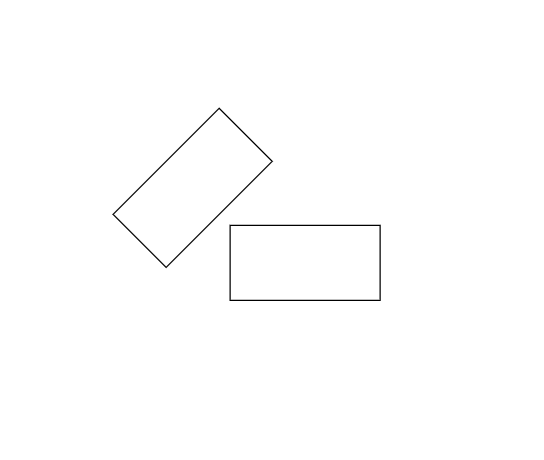

# Key to the solution
## Separating axis theorem (statement)
_2 closed convex objects are disjoint if there exists a line ("separating axis") onto which the two objects' projections are disjoint._

---

> **References**:
>
> - ["Use in collision detection" from _Hyperplane separation theorem_ from **Wikipedia**](https://en.wikipedia.org/wiki/Hyperplane_separation_theorem#Use_in_collision_detection)
> - [_Separating Axis Theorem_ from **textbooks.cs.ksu.edu/**](https://textbooks.cs.ksu.edu/cis580/04-collisions/04-separating-axis-theorem/)

---

To understand this, let us understand the concepts.

### CONCEPT 1: Axis
An axis is a line in a coordinate space that is or can be used as a reference for determining orientation. An axis can be represented in many ways:

- A unit vector that lies on the line
- A mapping between the main axes of the coordinate space   **Example**: $y = mx + c$, where $x$ and $y$ are the main axes

### CONCEPT 2: Projection of a point on an axis
The projection of a point $p$ on an axis is the intersection between the axis and the vector perpendicular to the axis that passes through $p$. Projection is a natural way to describe perspective, where the projected point is the apparent position of the point when viewed from the axis.

<i>Example of a point being projected</i>...

The black dot is projected on the blue axis as the blue dot:
 
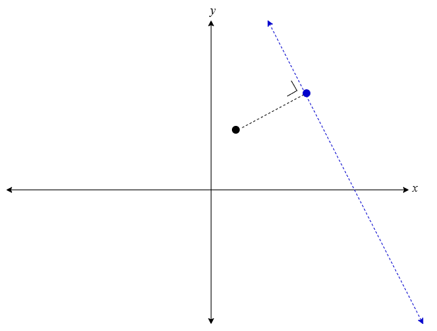

### CONCEPT 3: Projection of a figure on an axis
The projection of a figure $S$ on an axis is the projection of all its points on the axis. For example, the projection of an edge $E_1$ on an axis would be an edge $E_2$ on the axis that results from projecting all the points of $E_1$ onto the axis. As another example, the projection of a 2D shape $S$ on 1D axis would be an edge $E$ that results from projecting all the points of $S$ onto the axis. In practice, we can consider just the extremeties of the projection (i.e. the minimum and maximum points' coordinates of the edge on the axis resulting from the projection), which would be sufficient to help us detect overlaps on the axis.

<i>Example of a rectangle being projected on 2 axes</i>...

Visualisation of the projection of a rectangle:
 
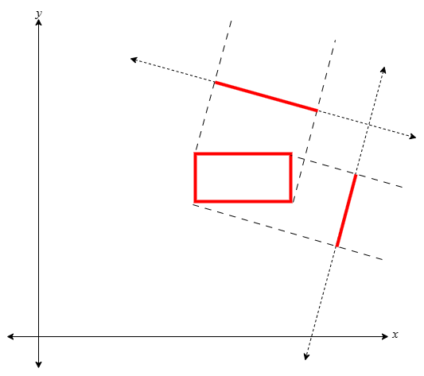
 
Considering only the extremeties:
 
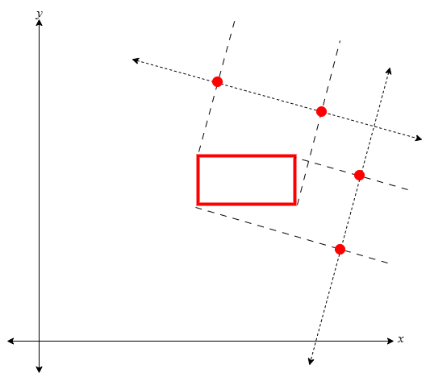

## Separating axis theorem (case-specific interpretation)
**NOTE**: _We consider a 2D coordinate space and 1D axes._

Consider a target figure $T$ and a set of other figures $R_1, R_2 ... R_k$. For each $R_i$, we have to check whether there exists an axis such that the projections of $T$ and $R_i$ are disjoint (i.e. non-overlapping).

But what is the minimum set of axes $A$ we must check to verify that there exists no such axis? Considering the edges of one figure ($R_i$ or $T$), $A$ is the set of axes are the axes parallel to the edges of both figures, such that each edge corresponds to an axis.

<i>Example involving 2 rectangles</i>...

Rectangles have pairs of parallel edges hence, A has size 2+2=4:
 
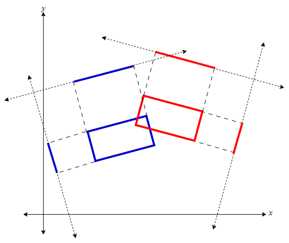

---

<b>CRUCIAL: Find axes parallel to the edges of <i>both</i> figures</b>:

It is insufficient to consider the axes parallel to the edges of just one figure. This can be proved a simple counterexample. Consider the following rectangles: R, aligned with the x and y axes, and S, rotated to an arbitrary angle and almost touching R. Now, what if we considered the axes parallel to the edges of S alone? Here is the visualisation (R is blue, S is red; also note that when we say "axes of a figure", we mean the axes derived from the parallels of the edges of the figure.):

<table>
    <tr>
        <th>All axes of S show overlap</th>
        <th>One axis of R shows no overlap</th>
    </tr>
    <tr>
        <td>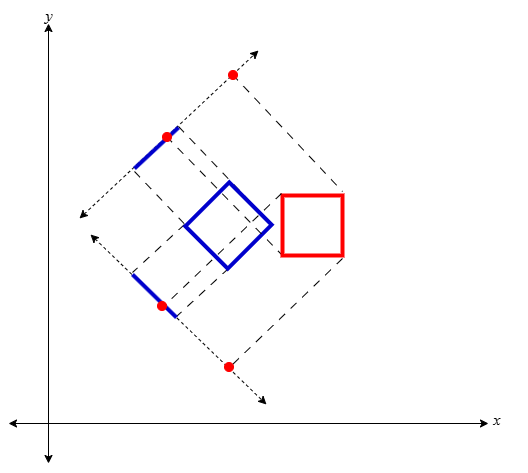</td>
        <td>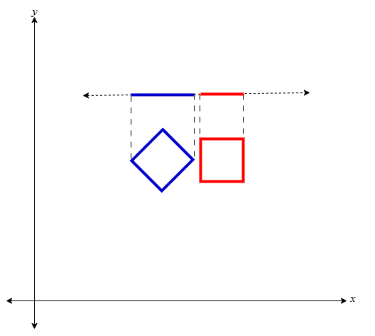</td>
    </tr>
</table>

Hence, we see why to consider the axes of both figures.

# Obtaining projections on an axis
Consider the following diagram:

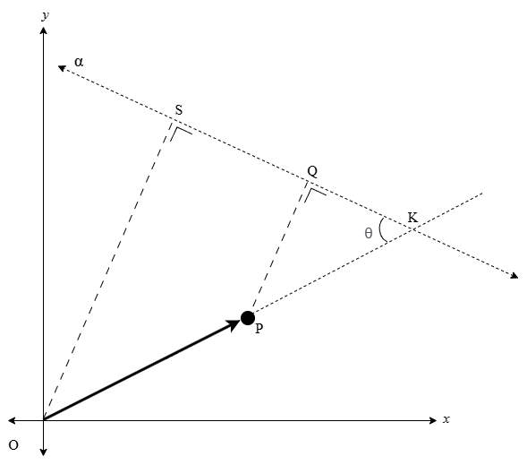

---

Here, we have the following:

- The origin, namely $O$
- The point to project, namely $P$
- The desired axis to project on, namely $\alpha$
- The projection of $O$ on $\alpha$, namely $S$
- The projection of $P$ on $\alpha$, namely $Q$
- Vector $\vec{OP}$ from the origin $O$ to point $P$
- $\theta$, the angle between $\vec{OP}$ and $\alpha$
- $K$ be the intersection between $\vec{OP}$ and $\alpha$

We project the origin so that it serves as a common point of reference with respect to which we can get the relative position of $Q$, where "relative" means with respect to the axis $\alpha$. Furthermore, we consider the point $K$ as it gives us a means to easily and accurately express the cosine of $\theta$, at least to begin with.

---

$\cos \theta = SK / OK$

---

Now, let us define the following for convenience:

- $A = \set{\alpha_1, \alpha_2 ...}$ is the set of all axes parallel to $\alpha$
- $S$ is the projection of $O$ onto a given $\alpha_i \in A$
- $Q$ is the projection of $P$ onto a given $\alpha_i \in A$
- $K$ is the intersection between $\vec{OP}$ and a given $\alpha_i \in A$

---

Note an interesting fact: shifting the axis $\alpha$ along its normal (i.e. along the vector perpendicular to it), which leads to some axis $\alpha_i \in A$, preserves the relative positions of the projections of $S$ and $P$, where "relative" means with respect to each other; thus, it also preserves the value of $SQ$, thereby preserving the relative position of the projection of $P$, where "relative" means with respect to the axis. Such a shift also preserves the angle $\theta$ between the vectors $\vec{OP}$ and the axis. In other words, any axis $\alpha_i \in A$ parallel to $\alpha$ has the same relative positions for the projections of $S$ and $P$ and the same value for $\theta$.

<i>Visualise the shifting of the axis</i>...

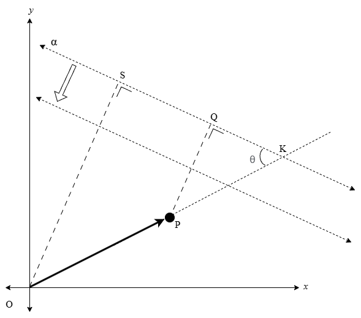

---

Take $\vec{OP}$. Consider an axis $\alpha_n \in A$ such that:

$KP = 0 \implies SK = SP$ and $OK = OP$

Then, here, we have:

$Q = P$

Hence:

$\cos \theta = SP / OP = \frac{SP}{\lvert \vec{OP} \rvert}$

---

Now, note the following:

$\lvert \vec{OP} \rvert \cos \theta = SP$

Now, let us consider a vector $\vec{v}$ such that:

- $\vec{v}$ lies on $\alpha_n$
- $\lvert \vec{v} \rvert = 1$ (i.e. $\vec{v}$ is a unit vector)

Then, we have that:

$\vec{v} \cdot \vec{OP}$

$= \lvert \vec{v} \rvert \lvert \vec{OP} \rvert \cos \theta$

$= \lvert \vec{OP} \rvert \cos \theta$

Thus, we have that:

$\vec{v} \cdot \vec{OP} = SP$

---

Now, note that:

$SP$ on axis $\alpha_n = SQ$ on any axis $\alpha_i \in A$

Hence, we have found the relative position of the projection of $P$ on any axis $\alpha_i \in A$, which of course means we have found its relative position on $\alpha$ also. Note that since the projection of the origin is constant, and since this projection can be used to obtaining the relative position of the projection of any other point, we now have the means to compare the projections of any 2 points on a given axis, which, by extension, gives us the means to compare the projections of any 2 figures on a given axis, which is key to checking whether the projections are disjoint or not. Hence, we have the basis for detecting overlaps between any 2 figures on a 2D plane, regardless of their orientations. Hence, we have the basis for a flexible collision detection method.

---

<i>Extending the logic for comparing 2 points...</i>

A visualisation of how the projection of 2 points can be compared:

<table>
    <tr>
        <th>Initial step</th>
        <th>Shifting axis</th>
    </tr>
    <tr>
        <td>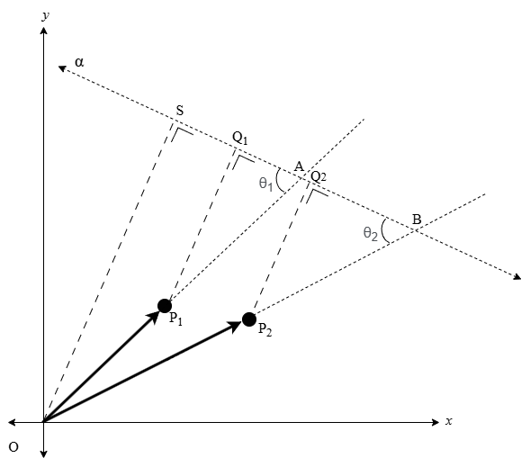</td>
        <td>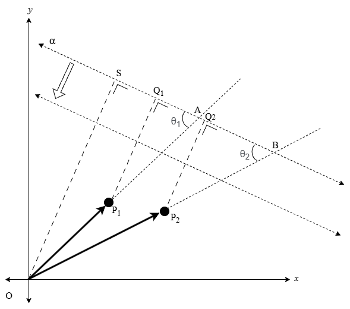</td>
    </tr>
</table>

---

**KEY POINT**: A point on a coordinate plane is actually given as a vector of values. For example, on a 2D plane, a point is given as $(x, y)$. Hence, if $O$ is the origin, then any point $P$ automatically denotes the vector $\vec{OP}$. Keep this point in mind as you read the solution approach.

# Overlap detection logic
## Detecting overlaps along a given axis
Consider 2 figures $P$ and $Q$. Hence, define:

- The corners of $P$ are the points $p_1, p_2, p_3, p_4$
- The corners of $Q$ are the points $q_1, q_2, q_3, q_4$
- Function $\pi$ that projects a given point onto axis $\alpha$

Hence obtain:

- $p_{\min} = \min(\pi(p_1), \pi(p_2), \pi(p_3), \pi(p_4))$
- $p_{\max} = \max(\pi(p_1), \pi(p_2), \pi(p_3), \pi(p_4))$
- $q_{\min} = \min(\pi(q_1), \pi(q_2), \pi(q_3), \pi(q_4))$
- $q_{\max} = \max(\pi(q_1), \pi(q_2), \pi(q_3), \pi(q_4))$

The projections do not overlap on $\alpha$ iff:

$p_{\max} < q_{\min}$ or $q_{\max} < p_{\min}$

## Detecting overlaps regardless of axes   
Now, consider the minimum set of axes, as defined [here](#separating-axis-theorem-case-specific-interpretation). Let this set of axes be $A$.

---

**Hence, the overlap detection logic is as follows**:

_For each_ $\alpha$ _in_ $A$:

- Detect overlap along $\alpha$
- If no overlaps exist along $\alpha$, $P$ and $Q$ do not overlap

$P$ _and_ $Q$ _overlap iff overlaps exist along each axis in_ $A$.

# Solution approach
- Let $T$ be the target figure
- Let the corners of $T$ be the points $t_1, t_2 ...$
- Let $R_1, R_2 ... R_k$ be a set figures
- Let the corners of $R_i$ be the points $r_{i,1}, r_{i,2} ...$
- Obtain the edges of $T$ as $T_1, T_2 ...$
- Obtain the edges of each $R_i$ as $R_{i,1}, R_{i,2} ...$
- Normalise the above to get the vectors $v_1, v_2 ...$   _They represent axes_ $\alpha_1, \alpha_2 ...$ _parallel to_ $T_1, T_2 ... R_{1,1}, R_{1,2} ... R_{2,1}, R_{2,2} ...$
- Obtain the projections of $t_1, t_2 ...$ on $\alpha_1, \alpha_2 ...$
- Obtain the projections of each $r_{i,1}, r_{i,2} ...$ on $\alpha_1, \alpha_2 ...$
- Perform overlap detection logic on the projections for each pair

---

**NOTE: Parallel operations**:

We can leverage parallel operations (e.g. using NumPy) to perform the above detections for each $R_1, R_2 ... R_k$ against $T$ all at once, thereby greatly speeding up the implementation.

# Practical testing
> [`autonomousNavigation`/`implementation`/`spatial_querying`, owned by `pranigopu`, GitHub](https://github.com/pranigopu/autonomousNavigation/tree/main/implementation/spatial_querying)   *Directory containing practical implementation and test cases*
> [`tests.ipynb` from the above](https://github.com/pranigopu/autonomousNavigation/blob/main/implementation/spatial_querying/tests.ipynb)   *Comprehensive testing of practical implementation via Jupyter Notebook*