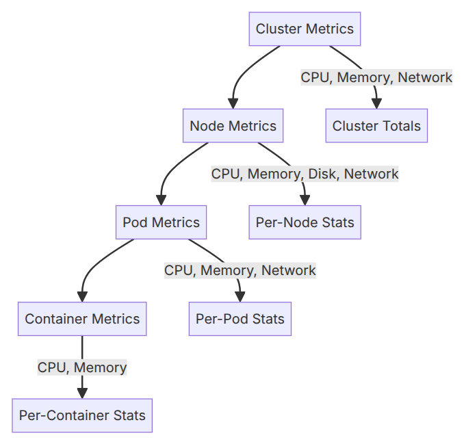

[<< **Observability in AWS**](https://pranigopu.github.io/observability-in-aws/)

**[DESIGN FOCUS]**

<h1>CloudWatch Container Insights for EKS</h1>

---

**Contents**:

- [Overview](#overview)
- [The Precise Nature of Container Insights as a Managed Observability Layer](#the-precise-nature-of-container-insights-as-a-managed-observability-layer)
- [Metrics Collected by Container Insights for EKS](#metrics-collected-by-container-insights-for-eks)
- [Container Insights vs. Enhanced Container Insights](#container-insights-vs-enhanced-container-insights)
- [How Container Insights on EKS Builds on CloudWatch](#how-container-insights-on-eks-builds-on-cloudwatch)
    - [Data Collection via Containerised CloudWatch Agent](#data-collection-via-containerised-cloudwatch-agent)
    - [Embedded Metric Format (EMF) as the Bridge](#embedded-metric-format-emf-as-the-bridge)
  - [What Container Insights Adds for EKS](#what-container-insights-adds-for-eks)
    - [1. Container-Level Granularity](#1-container-level-granularity)
    - [2. Kubernetes-Specific Telemetry](#2-kubernetes-specific-telemetry)
    - [3. Curated, Automatic Dashboards](#3-curated-automatic-dashboards)
    - [4. Diagnostic Information](#4-diagnostic-information)
    - [5. Prometheus \& OpenTelemetry Integration](#5-prometheus--opentelemetry-integration)
    - [6. Accelerated Compute Observability](#6-accelerated-compute-observability)
  - [Summary Table (EKS scope)](#summary-table-eks-scope)
- [Installation Methods](#installation-methods)
  - [Managed EKS Add-on](#managed-eks-add-on)
  - [Helm chart (`amazon-cloudwatch-observability`)](#helm-chart-amazon-cloudwatch-observability)
  - [Final Remarks on Installation Methods](#final-remarks-on-installation-methods)
- [Out of Scope: Broader Container Insights Topics](#out-of-scope-broader-container-insights-topics)

---

# Overview
Amazon CloudWatch is AWS's foundational monitoring platform - it collects metrics, stores logs, and fires alarms across AWS resources. Essentially, CloudWatch is an archive built to store AWS metrics’ time series data. CloudWatch converts raw data feeds into digestible, actionable information. CloudWatch provides a set of predefined variables for free. Container Insights is a purpose-built layer on top of CloudWatch for containerised workloads. On EKS specifically, it extends CloudWatch with Kubernetes-aware data collection, deeper granularity, and a curated console experience - without replacing CloudWatch's underlying primitives.

**NOTE**: CloudWatch primitives => Core building blocks that...

- collect
- aggregate
- analyze

... telemetry data

> **References**:
>
> - [*Amazon CloudWatch*, **www.amazonaws.cn/en**](https://www.amazonaws.cn/en/cloudwatch/)
> - [*What is AWS CloudWatch?*, **www.bluematador.com/blog**](https://www.bluematador.com/blog/aws-cloudwatch-101)
> - [*Amazon CloudWatch Container Insights*, **aws-observability.github.io/observability-best-practices/guides/containers/aws-native/eks**](https://aws-observability.github.io/observability-best-practices/guides/containers/aws-native/eks/amazon-cloudwatch-container-insights/)

---

It is key to note that Container Insights is a fully managed service that collects, aggregates, and summarizes Amazon ECS metrics and logs, providing a dashboard with CPU/memory utilization, task and service counts, read/write storage, network Rx/Tx, and container instance counts. The automatic dashboards, alarm integration, and ECS/EKS-aware aggregation logic are genuine product features, not just a reinterpretation of raw CloudWatch data.  That being said, Container Insights does not store data independently and relies on CloudWatch primitives.

# The Precise Nature of Container Insights as a Managed Observability Layer
> *"Container Insights is a managed observability layer that uses CloudWatch Logs as its data backbone and derives CloudWatch Metrics from structured log events, while also deploying active collection agents."*

Each clause carries a precise technical meaning.

**"managed observability layer"**:

Container Insights does not replace CloudWatch - it extends it. It is a purpose-built feature *on top of* CloudWatch's existing primitives (Logs and Metrics), adding Kubernetes-aware data collection, deeper granularity, and a curated console experience without introducing an independent data store. AWS owns the lifecycle of the underlying components; the operator enables the feature, not an independent monitoring stack.

**"uses CloudWatch Logs as its data backbone"**:

All performance data collected by Container Insights is first written to CloudWatch Logs as structured JSON entries using the **Embedded Metric Format (EMF)** - a schema that enables high-cardinality data to be ingested and stored at scale. CloudWatch Logs is not a secondary sink; it is the primary store. The raw EMF log events remain directly queryable via CloudWatch Logs Insights, providing granularity beyond what the derived metrics expose. This matters for cost management: CloudWatch does not automatically create all possible metrics from the log data, but the underlying log events are always available for ad-hoc queries.

**"derives CloudWatch Metrics from structured log events"**:

CloudWatch Metrics are not collected independently. They are *extracted* from the EMF log events after ingestion. From the structured JSON, CloudWatch creates aggregated metrics at the cluster, node, pod, task, and service level. These derived metrics are standard CloudWatch metrics - they live in the same namespace, obey the same retention rules, and work with existing CloudWatch alarms without modification. The pipeline is therefore:

```
agent -> EMF log event -> CloudWatch Logs -> metric extraction -> CloudWatch Metrics
```

**"while also deploying active collection agents"**:

Container Insights is not a passive interpreter of data already in CloudWatch. It deploys real infrastructure to collect data that CloudWatch does not have access to on its own. On EKS, this is a containerised CloudWatch agent running as a **DaemonSet** - one agent pod per node - scraping kubelet, cAdvisor, and the container runtime. When using the OpenTelemetry Collector, the `awscontainerinsight` receiver performs the scraping of container-level metrics to provide this data to the OpenTelemetry Collector, which can then repackage the data as per OpenTelemetry standards and forward it to Container Insights. These agent - be it the CloudWatch agent or the `awscontainerinsight` receiver for the OpenTelemetry Collector - are the origin of the data pipeline, not a configuration of it.

---

Hence, note that Container Insights:

- Is NOT a tool
- Is a layer, i.e. a system of:
    - Performance data format/contract <br> I.e.: EMF; see: ["Embedded Metric Format (EMF) as the Bridge" in this document](#embedded-metric-format-emf-as-the-bridge)
    - Performance data collection agents
    - Data delivery systems to send data to CloudWatch
    - A CloudWatch based backend that defines:
        - The CloudWatch Logs service that enable:
            - Writing event logs
            - Querying event logs
        - Standard format for defining CloudWatch metrics <br> **NOTE**: *For Container Insights, CloudWatch metrics are derived from CloudWatch Logs*

Container Insights is a Kubernetes-aware observability layer on top of CloudWatch that collects performance data via active agents (a CloudWatch agent DaemonSet and Fluent Bit), structures it as EMF log events in CloudWatch Logs, and derives standard CloudWatch metrics from those events - introducing Kubernetes semantics (pod, node, container, control plane, Kube-state) that CloudWatch cannot express natively. ***Container Insights is best understood as a specification for what gets collected and how it is structured, with the agent as the pluggable component.***

# Metrics Collected by Container Insights for EKS
Container Insights for EKS captures metrics at multiple levels. At each level, you get CPU utilization, memory usage, network I/O, and (where applicable) filesystem usage. You also get Kubernetes-specific metrics like pod restart counts, pod status, and node conditions.

> **Reference**: [*How to Set Up CloudWatch Container Insights for EKS*, **oneuptime.com/blog**](https://oneuptime.com/blog/post/2026-02-12-cloudwatch-container-insights-eks/view)



> **Source**: [*How to Set Up CloudWatch Container Insights for EKS*, **oneuptime.com/blog**](https://oneuptime.com/blog/post/2026-02-12-cloudwatch-container-insights-eks/view)
>
> **Quote from the above source**: "Container Insights on EKS works differently from the ECS version. On ECS, you flip a switch and you're done. On EKS, you need to deploy agents into your cluster. But once it's running, you get deep visibility into your Kubernetes workloads - from the cluster level all the way down to individual containers."

# Container Insights vs. Enhanced Container Insights
> **NOTE**: Enhanced Container Insights = Container Insights with Enhanced Observability for EKS

***These are not 2 separate products.*** Enhanced Observability is the newer, more capable tier of the same feature, released on November 6, 2023.

> **Reference**: [*AWS Documentation - Container Insights with enhanced observability for Amazon EKS*, **docs.aws.amazon.com/AmazonCloudWatch/latest/monitoring**](https://docs.aws.amazon.com/AmazonCloudWatch/latest/monitoring/container-insights-detailed-metrics.html)

The original version collected resource metrics at cluster, node, and pod level and charged per metric stored and per log ingested (i.e. they are charged as custom metrics). Enhanced Observability adds container-level metrics, Kube-state metrics, EKS control plane metrics, curated dashboards, and a different observation-based pricing model.

> **Reference**: [*AWS What's New - Enhanced Observability for EKS, November 2023*, **aws.amazon.com/about-aws/whats-new/2023/11**](https://aws.amazon.com/about-aws/whats-new/2023/11/amazon-cloudwatch-container-insights-enhanced-observability-eks)

**KEY POINT**: For new installations, both installation methods, the EKS add-on and Helm chart enable Enhanced Observability by default (for more on installation methods, see ["Installation Methods" in this document](#installation-methods)).

> **Reference**: [*AWS Documentation - Install the CloudWatch agent with the EKS add-on or Helm chart*, **docs.aws.amazon.com/AmazonCloudWatch/latest/monitoring**](https://docs.aws.amazon.com/AmazonCloudWatch/latest/monitoring/install-CloudWatch-Observability-EKS-addon.html)

Clusters installed via the CloudWatch agent before November 6, 2023 remain on the original version and require an explicit upgrade step to move to Enhanced Observability - AWS documents the upgrade path but does not frame the original version as deprecated (*note that what matters is the installation date of the CloudWatch agent, not the cluster creation date*).

> **Reference**: [*AWS Documentation - Container Insights with enhanced observability for Amazon EKS*, **docs.aws.amazon.com/AmazonCloudWatch/latest/monitoring**](https://docs.aws.amazon.com/AmazonCloudWatch/latest/monitoring/container-insights-detailed-metrics.html)


# How Container Insights on EKS Builds on CloudWatch
### Data Collection via Containerised CloudWatch Agent
Container Insights feeds into CloudWatch rather than bypassing it. On EKS, it deploys a containerised version of the CloudWatch agent as a DaemonSet to discover all running containers in a cluster and collect performance data at every layer of the performance stack.

> **Reference**: [*AWS Prescriptive Guidance - Metrics for Amazon EKS and Kubernetes*, **docs.aws.amazon.com/prescriptive-guidance/latest/implementing-logging-monitoring-cloudwatch**](https://docs.aws.amazon.com/prescriptive-guidance/latest/implementing-logging-monitoring-cloudwatch/kubernetes-eks-metrics.html)

### Embedded Metric Format (EMF) as the Bridge
Container Insights stores data in CloudWatch Logs using the **Embedded Metric Format (EMF)** - a structured JSON schema enabling high-cardinality data to be ingested and stored at scale. CloudWatch then derives aggregated metrics at the cluster, node, pod, and service level from these log events.

> **Reference**: [*AWS Observability Best Practices - Amazon CloudWatch Container Insights*, **aws-observability.github.io/observability-best-practices/guides/containers/aws-native/eks**](https://aws-observability.github.io/observability-best-practices/guides/containers/aws-native/eks/amazon-cloudwatch-container-insights/)

2 things follow from this approach. (1) Raw high-cardinality log events are queryable via CloudWatch Logs Insights for granularity beyond what standard metrics expose. (2) As indicated earlier in the [Overview](#overview) (with the statement "replacing CloudWatch's underlying primitives"), the derived metrics are standard CloudWatch metrics, so existing CloudWatch alarms work without modification.

## What Container Insights Adds for EKS
### 1. Container-Level Granularity
Standard CloudWatch metrics for EKS operate at coarse granularity - typically cluster or service level. Container Insights drills down to the individual container, enabling teams to spot issues like memory leaks in individual containers and reduce mean time to resolution

> **Reference**: [*AWS What's New - Enhanced Observability for EKS, November 2023*, **aws.amazon.com/about-aws/whats-new/2023/11**](https://aws.amazon.com/about-aws/whats-new/2023/11/amazon-cloudwatch-container-insights-enhanced-observability-eks)

### 2. Kubernetes-Specific Telemetry
***(Kube-State Metrics & Control Plane)***

*CloudWatch has no native understanding of Kubernetes abstractions.*

Enhanced Container Insights introduces:

<details><summary><b>Kube-state metrics</b></summary>
<p>
Kube-state-metrics (KSM) is a simple service that listens to the Kubernetes API server and generates metrics about the state of the objects. (See examples in the Metrics section below.) It is not focused on the health of the individual Kubernetes components, but rather on the health of the various objects inside, such as deployments, nodes and pods (see: <a href="https://github.com/kubernetes/kube-state-metrics"><code>kubernetes/kube-state-metrics</code>, <b>github.com</b></a>)
</p>
</details>

<details><summary><b>EKS control plane metrics</b></summary>
<p>
API server latency, etcd health, scheduler metrics, and kube-controller-manager metrics, enabling cluster administrators to quickly detect and troubleshoot issues (see: <a href="https://www.infoq.com/news/2023/12/aws-kubernetes-observability/">*InfoQ - AWS Improves Kubernetes Monitoring with Enhanced Observability for EKS, December 2023*, <b>www.infoq.com/news/2023/12</b></a>).
</p>
</details>

These are surfaced:

- Automatically once the CloudWatch Observability add-on is installed
- With no manual Prometheus scrape configuration required

> **Additional reference**: [**Announcing Amazon CloudWatch Container Insights with Enhanced Observability for Amazon EKS on EC2*, **aws.amazon.com/blogs/mt***, **aws.amazon.com/blogs/mt**](https://aws.amazon.com/blogs/mt/new-container-insights-with-enhanced-observability-for-amazon-eks/)

### 3. Curated, Automatic Dashboards
Container Insights provides out-of-the-box dashboards at cluster, node, pod, workload, and container level, with predefined CPU and memory thresholds and top-ten resource lists. Drilling into a resource opens a performance dashboard with utilisation across cluster, node, pod, and container level.

> **Reference**: [*InfoQ - AWS Improves Kubernetes Monitoring with Enhanced Observability for EKS, December 2023*, **www.infoq.com/news/2023/12**](https://www.infoq.com/news/2023/12/aws-kubernetes-observability/)

### 4. Diagnostic Information
With Container Insights, you can monitor, isolate, and diagnose issues in your Kubernetes clusters with minimal effort. It delivers infrastructure telemetry like CPU, memory, network, and disk usage for your clusters, services, and pods in the form of metrics and logs that can be easily visualized in the CloudWatch console

> **Reference**: [*Announcing Amazon CloudWatch Container Insights with Enhanced Observability for Amazon EKS on EC2*, **aws.amazon.com/blogs/mt**](https://aws.amazon.com/blogs/mt/new-container-insights-with-enhanced-observability-for-amazon-eks/)

More specifically, Container Insights surfaces structured operational diagnostics - such as container restart failures - that CloudWatch alone does not provide, making problem isolation faster than parsing raw log streams or reading generic alarm states.

> **Reference**: [*AWS Documentation - Container Insights*, **docs.aws.amazon.com/AmazonCloudWatch/latest/monitoring**](https://docs.aws.amazon.com/AmazonCloudWatch/latest/monitoring/ContainerInsights.html)

### 5. Prometheus & OpenTelemetry Integration
The CloudWatch agent auto-discovers Prometheus metrics from containerised workloads on EKS and forwards them to CloudWatch as performance log events, removing the need for a standalone Prometheus server.

> **Reference**: [*AWS Observability Best Practices - Collecting service metrics with Container Insights*, **aws-observability.github.io/observability-best-practices/guides/containers/aws-native/ecs**](https://aws-observability.github.io/observability-best-practices/guides/containers/aws-native/ecs/best-practices-metrics-collection-2/)

As of April 2026, a public preview extends this further: Container Insights with OpenTelemetry metrics collects via OTLP and supports PromQL queries in CloudWatch Query Studio, with each metric enriched with up to 150 labels including Kubernetes metadata and custom pod labels.

> **Reference**: [*AWS What's New - OTel Container Insights for EKS Preview, April 2026*, **aws.amazon.com/about-aws/whats-new/2026/04**](https://aws.amazon.com/about-aws/whats-new/2026/04/cloudwatch-otel-container-insights-eks)

### 6. Accelerated Compute Observability
Enhanced Container Insights auto-discovers health metrics from specialized hardware - NVIDIA GPUs, AWS Trainium, AWS Inferentia, and Elastic Fabric Adapters - and surfaces them in curated dashboards. Using Enhanched Container Insights, you can now easily correlate compute and memory metrics with your internode network metrics to help understand the traffic impact on tasks running on your EKS clusters, such as monitoring latency-sensitive training jobs. Enhanced Container Insights enables you to easily monitor the efficiency of resource consumption by your distributed deep learning and inference algorithms such that you can optimize resource allocation and minimize long disruptions in your applications. Enhanced Container Insights delivers accelerated compute observability with automatic visualizations and removes the need for manual dashboard creations and alarm set-ups

> **Reference**: [*AWS What's New - Accelerated Compute Observability on EKS, April 2024*, **aws.amazon.com/about-aws/whats-new/2024/04**](https://aws.amazon.com/about-aws/whats-new/2024/04/cloudwatch-container-insights-compute-observability-eks/)

---

## Summary Table (EKS scope)

| Capability | Standard CloudWatch | With Container Insights on EKS |
|---|---|---|
| CPU/Memory/Network metrics | Cluster/service level | Cluster -> Node -> Pod -> Container |
| Kubernetes Kube-state metrics | Not available | Available (Enhanced Observability) |
| EKS control plane metrics | Not available | Available |
| Automatic topology dashboards | Manual setup | Pre-built, curated |
| Container restart diagnostics | Not available | Available |
| Prometheus auto-discovery | Manual setup | Via CloudWatch agent |
| Accelerated compute (GPU, Trainium, EFA) | Not available | Auto-discovered |
| OpenTelemetry / PromQL support | Not available | Preview (April 2026) |

# Installation Methods
## Managed EKS Add-on
Installed via `aws eks create-addon` or as a one-click install through the EKS console, and also deployable via CloudFormation, CDK, or Terraform (see: [AWS What's New - OTel Container Insights for EKS Preview, April 2026](https://aws.amazon.com/about-aws/whats-new/2026/04/cloudwatch-otel-container-insights-eks)). AWS manages version compatibility with your Kubernetes version and can push security patches without requiring manual intervention. The trade-off is less configurability - changes go through the EKS add-on API rather than a values file. Best suited to teams who want AWS to own the upgrade path.

## Helm chart (`amazon-cloudwatch-observability`)
Installs the CloudWatch agent DaemonSet and Fluent Bit for log forwarding in a single `helm install` command, using the `aws-observability` Helm repository (see: [OneUptime - How to Set Up CloudWatch Container Insights for EKS](https://oneuptime.com/blog/post/2026-02-12-cloudwatch-container-insights-eks/view)). Because it is a standard Helm release, cluster name, region, and enabled components can be customised via values at install time, and the release can be upgraded or rolled back through normal Helm workflows. Best suited to teams managing cluster add-ons via Helm or GitOps pipelines.

## Final Remarks on Installation Methods
- Both methods deploy the same underlying agent
- The choice is: operational ownership vs. configuration flexibility.

---

**NOTE: CloudWatch Application Signals**: Both installation methods also enable CloudWatch Application Signals by default, not only Enhanced Observability. Application Signals has its own billing model - charged per inbound request, per outbound request, and per SLO measurement period - separate from the observation-based pricing of Enhanced Container Insights. Operators evaluating cost should account for this before installing via either method.

> **References**:
> 
> - [*What is Amazon CloudWatch?*, **docs.aws.amazon.com/AmazonCloudWatch/latest/monitoring**](https://docs.aws.amazon.com/AmazonCloudWatch/latest/monitoring/WhatIsCloudWatch.html)
> - [*Application Signals*, **docs.aws.amazon.com/AmazonCloudWatch/latest/monitoring**](https://docs.aws.amazon.com/AmazonCloudWatch/latest/monitoring/CloudWatch-Application-Monitoring-Sections.html)

---

\[NOT COVERED\]: A third, distinct path for **EKS Fargate**.

# Out of Scope: Broader Container Insights Topics
This document focuses on EKS. The following areas are not covered:

- ECS support
- Fargate-specific data collection
- Self-managed Kubernetes on EC2
- Red Hat OpenShift on AWS (ROSA)
- Cross-account observability
- Pricing model differences