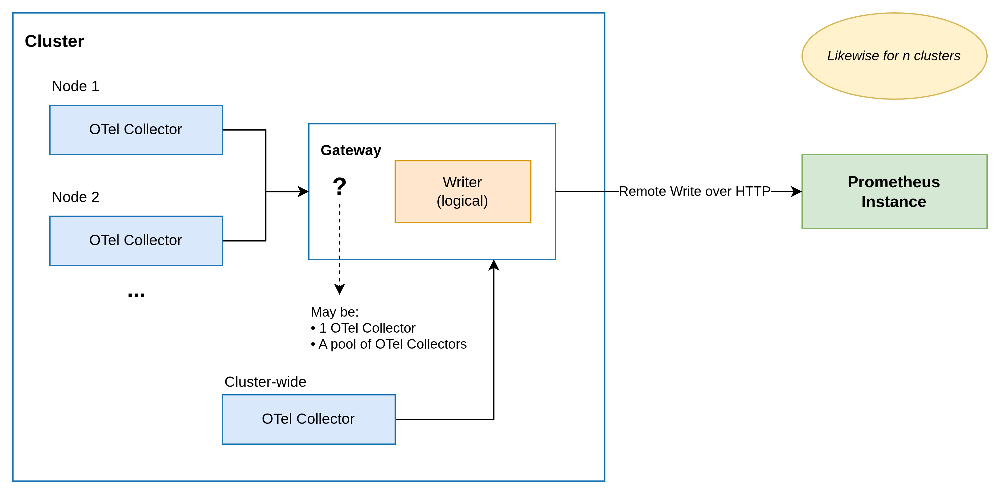

[<< **Observability**](https://pranigopu.github.io/observability)

**Context**: [OPCM](./opcm.md)

<h1>OPCM</h1>

**Main Page**:

> OPCM = OTel + Prometheus Centralised Monitoring

---

**Contents**:

- [About](#about)
- [Navigate](#navigate)

---

# About
I recently created an observability solution for my organisation. The key ask was to standardise the format of metrics collected within our AWS EKS infrastructure using OTel (see: [OTel](./otel.md)). For context, our infrastructure consists of a few AWS EKS clusters, along with other cloud-hosted services/platforms, which were accessible from our EKS clusters via methods such as VPC peering. The other ask, later on, was to use Prometheus (see: [Prometheus](./prometheus.md)) as the system for metrics aggregation, i.e. for the storage and downstream processing of metrics. The collection-level tool decided for this purpose was the OTel Collector (see: ["OTel Collector", OTel](./otel.md#otel-collector)), as it was a open-source, mature, and versatile tool maintained by the OTel project itself. Apart from standarisation using OTel, the other key goal of this project was to centralise telemetry across our infrastructure. The architecture was broadly as follows:

To sum up, this project is about centralised metrics monitoring, standardised using OTel framework, hosted on Kubernetes as the platform (via AWS EKS) and AWS as the cloud provider, centralised using Prometheus as the metrics aggregator, with OTel Collectors as the collection-point for local (in-cluster) telemetry. More abstractly, there are remote sources - endpoints within a cluster, clusters within a set of clusters, all spokes to a hub - and a central system - the hub itself - for receiving, processing, and storing telemetry from these remote sources.

# Navigate
- [Philosophical Compromise & Potential](./opcm-philosophical-compromise-and-potential.md)